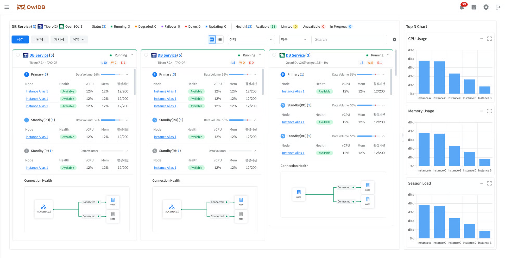

Provides summary information and notifications about the status of all databases and instances in operation. **OwlDB console screen > OwlDB logo**Click to view the dashboard.

<figure>

<figcaption>Figure 1. Dashboard</figcaption>
</figure>

# Checking the overall status summary information 

Checks the top-level status value (**Status**) and detailed status value (**Health**) for all databases/instances in operation. Clicking each status lets you view '[Checking the DB Service/instance list](#service-instance-list)' where you can view the list of DB Services/instances with the corresponding status value.



The top-level status, Status, is displayed per database.

- Since the status can change per instance node, the count is displayed next to the status in the form (n/m). n: Number of available instance nodes m: Total number of instance nodes
- Types marked in Bold and followed by `*`can be filtered on the dashboard.

| Type | Description |
| --- | --- |
| Provisioning | Creating a new resource |
| **Running** * | Database is available for normal use |
| **Updating** * | Applying planned operations or changes to the database (e.g., full restart, role switchover, spec change, migration, recovery, etc.) |
| **Degraded** * | Some databases or components are unavailable (e.g., individual instance restart, etc.) |
| **Failover** * | The system has detected a database failure and is performing Auto Failover (occurs when the entire Primary DB cluster becomes Unavailable) |
| **Down** * | All databases are unavailable (both Primary and Standby are unavailable) |
| Starting | Transitioning from Stopped to Running |
| Stopping | Transitioning from Running to Stopped (rolling back transactions and stopping processes, then transitioning to VM shutdown) |
| Stopped | All resources are temporarily not in use (resource deactivation) |
| Terminating | Permanently deleting all resources and data (access and recovery are not possible once complete) |

*표기는 필수 입력 항목을 의미합니다.

The * mark indicates a required input field.


The detailed status, Health, is displayed per instance node.

- Displayed by combining DB Boot Mode, Instance, cluster management tool (hereinafter CMT), and Agent connection status.
- Functions restricted according to the message can be checked via a banner when entering each menu.

The Health determination criteria for each engine are as follows.

- Tibero: Determined by combining DB Boot Mode, cluster management tool (CMT), and Agent status.
- OpenSQL: Determined by combining Patroni, OpenProxy, etcd, and Agent status.



| Display | Status | Message | Description |
| --- | --- | --- | --- |
| 🟢 Available | available | - | Node normal |
| 🟡 Limited | limited | Issue: CMT Inactive | Cluster management tool (CMT) abnormal |
|   | limited | Issue: Mount Mode | Node started in Mount mode |
| 🔴 Unavailable | unavailable | Issue: Nomount Mode | Node started in Nomount mode |
|   | unavailable | Issue: DB Down | Node DB Down |
|   | unavailable | Issue: Agent Disconnect | Agent connection lost with the VM where the node is located |
|   | unavailable | Issue: VM Down | VM where the node is located is Down |
| ⚫ Retired | retired | Issue: Failovered Primary | Performing Failover (former Primary terminated abnormally) |


The Health of an OpenSQL instance node is determined by combining the states of Patroni, OpenProxy, etcd, and Agent.

| Display | Status | Message | Description |
| --- | --- | --- | --- |
| 🟢 Available | available | - | Node normal |
| 🟡 Limited | limited | Issue: etcd Inactive | etcd abnormal |
|   | limited | Issue: OpenProxy Inactive | OpenProxy abnormal |
| 🔴 Unavailable | unavailable | Issue: DB Down | DB Down due to Patroni abnormal |
|   | unavailable | Issue: Agent Disconnect | Agent connection lost with the VM where the node is located |



`🔵 In Progress` The status applies commonly to both Tibero and OpenSQL.

| Level | Message |
| --- | --- |
| Individual instance node | Reboot, Switchover, Failover, Rebuilding, Modify Spec (TAC Scale In/Out) |
| All instances | Modify Spec (Scale Up/Down), Migration, Restoring, Patch/Upgrade, Starting, Stopping |


**Note**

A cluster management tool is a component required to operate a database in a cluster configuration. (e.g., Tibero Cluster Manager (CM), Tibero Active Storage (TAS), etc.)




# Checking the DB Service/instance list 

Check the entire DB Service and the list of sub-instances. '[Checking the overall status summary information](#status-summary)' The DB Service and instance list displayed varies depending on the status value selected in.

- You can perform restart operations on the sub-instances of the selected database.
- You can perform start, stop, delete, role switchover, and license renewal management operations on the selected database.
- Provides a search function for database/instance aliases.


**Note**

You can perform various management operations on the DB Service. For details, see **Operations** You can check it on the page.


### Switch list view (Card View / List View) 

You can view the DB Service/instance list in two ways: card view and list view. When switching views, the sort function is reset, but filtering is maintained.



The card view displays the main information of the DB Service in individual card form, making it easy to grasp visually. Up to 4 cards are displayed per row, and the size of each card is fixed. If the content exceeds the fixed size, internal scrolling is enabled. In the last cell of the currently operating DB Service card list, `➕` icon is displayed, and clicking it navigates to the DB Service creation page.

<table><thead><tr><th>Item</th><th>Description</th></tr></thead><tbody><tr><td>DB Service information</td><td>Summarizes the main information of the database at the top of the card Displayed items<ul><li>DB Type Logo</li><li>DB Service Name</li><li>Status</li><li>DB Type</li><li>DB version (for OpenSQL, the OpenSQL version and PostgreSQL version are displayed simultaneously)</li><li>Topology</li><li>Eventlog : I / W / E (Info / Warning / Error respectively)</li></ul></td></tr><tr><td>Node information</td><td>Displays the information of instances linked under the database. Can be collapsed/expanded in accordion form based on Role Sort rules<ul><li>Tibero: Displayed in the order of Primary → Standby(Read Only) → Standby(Recovery)</li><li>OpenSQL: Displayed in the order of Leader → Replica</li><li>Sorted by AZ within the same Role</li></ul>Displayed items<ul><li>Role : Displays the number of instances for that role</li><li>Data volume (Tibero) / Volume (OpenSQL): Displays usage(%), bar chart, and Threshold</li></ul>Table items<ul><li>Instance alias</li><li>Health</li><li>vCPU: Current CPU usage(%)</li><li>Memory: Current memory usage(%)</li><li>Active sessions: Current number of active sessions / Max Session Count (not displayed for Standby(Recovery))</li><li>Availability zone: AZ information where the instance is located</li></ul></td></tr><tr><td>Cluster information</td><td>Displays Connection Health as a cluster diagram<ul><li>Single: Displays only Primary/Leader DB information</li><li>Single +DR / HA: Displays Primary/Leader DB and Standby/Replica DB information. Displays P-S connection status monitoring information, and Standby/Replica DBs are created individually per AZ</li><li>Tibero TAC: Displays multiple nodes within the Primary DB Box</li><li>Tibero TAC + DR: Displays Primary DB and Standby DB information. Displays P-S connection status monitoring information, multiple nodes are displayed within the Primary DB Box, and Standby DBs are created individually per AZ</li><li>DR configuration connection status monitoring: Represents the connection status between Primary - Standby / Leader - Replica through line color and displayed information</li><li>Normal: green,<code>Connected</code></li><li>Failure: red,<code>Disconnected</code></li></ul></td></tr></tbody></table>


The list view displays the database and sub-instance information in a tree-form table, making it easy to grasp the hierarchical structure.


**Note**

'Default' refers to items exposed by default on the initial screen, and 'Required' refers to items that cannot be hidden.


<table><thead><tr><th>Column</th><th>Description</th><th>DB Service level</th><th>Instance level</th><th>Default value</th><th>Required value</th></tr></thead><tbody><tr><td><strong>Name</strong></td><td>Name display<ul><li>Clicking the DB Service name navigates to the '<a href="https://github.com/hhjinn/gitbookPAT/tree/dori/TgpIeVAAe6TUtfrjaD2G/doc/5d7daeb2-e4f4-4409-aa74-dcaf1d65ab46/README.md">Service meta information inquiry</a>' page</li><li>Clicking the instance alias navigates to the '<a href="https://github.com/hhjinn/gitbookPAT/tree/dori/TgpIeVAAe6TUtfrjaD2G/doc/dF57s45IXBUgU7RX1UvL/README.md">Instance management</a>' page</li></ul></td><td>DB Service name</td><td>Instance alias</td><td>O</td><td>O</td></tr><tr><td><strong>Creation date</strong></td><td>Displays the DB Service creation date in <code>yyyy.mm.dd HH\:mm:ss</code> format</td><td>DB Service creation date</td><td>X</td><td>X</td><td>X</td></tr><tr><td><strong>Status</strong></td><td>Status or Health display</td><td><ul><li>Creating</li><li>Running(n/m)</li><li>Updating(n/m)</li><li>Degraded(n/m)</li><li>Failover(n/m)</li><li>Down(n/m)</li><li>Starting</li><li>Stopping</li><li>Stopped</li><li>Terminating</li><li>Deploying (on-premise)</li><li>Registering (on-premise)</li><li>Unregistering (on-premise)</li></ul></td><td><ul><li>🟢 (available)</li><li>🟡 (limited)</li><li>🔵 (in progress)</li><li>🔴 (unavailable)</li></ul></td><td>O</td><td>O</td></tr><tr><td><strong>Type</strong></td><td>Displays the database engine type</td><td><ul><li>Tibero</li><li>OpenSQL</li></ul></td><td>-</td><td>O</td><td>X</td></tr><tr><td><strong>Configuration</strong></td><td>Displays topology or role</td><td><ul><li>Tibero: Single, TAC(+DR)</li><li>OpenSQL: Single, HA</li></ul></td><td><ul><li>Tibero: Primary, Standby(Read Only), Standby(Recovery)</li><li>OpenSQL: Leader, Replica</li></ul></td><td>O</td><td>O</td></tr><tr><td><strong>Availability zone (Cloud)</strong></td><td>In a Cloud environment, displays the availability zone (AZ) information where the instance is located</td><td>-</td><td>Availability zone (AZ) information</td><td>O</td><td>X</td></tr><tr><td><strong>vCPU</strong></td><td>Displays the number of CPUs and usage as a bar chart</td><td>O</td><td>O</td><td>O</td><td>X</td></tr><tr><td><strong>Memory</strong></td><td>Displays Memory and usage as a bar chart</td><td>O</td><td>O</td><td>O</td><td>X</td></tr><tr><td><strong>Active sessions</strong></td><td>Displays the number of currently active sessions as a bar chart<ul><li>Displayed only for Primary / Standby(RO) / Leader / Replica</li><li>Standby(Recovery) :<code>-</code>Displayed as</li></ul></td><td>O</td><td>O</td><td>O</td><td>X</td></tr><tr><td><strong>Data Volume (Tibero)</strong></td><td>Displays data volume usage as a bar chart + Threshold display</td><td>O</td><td>X</td><td>O</td><td>X</td></tr><tr><td><strong>Redo log Volume (Tibero)</strong></td><td>Displays redo log volume usage as a bar chart</td><td>O</td><td>X</td><td>X</td><td>X</td></tr><tr><td><strong>Archive log Volume (Tibero)</strong></td><td>Displays archive log volume usage as a bar chart</td><td>O</td><td>X</td><td>X</td><td>X</td></tr><tr><td><strong>Root Volume</strong></td><td>Display Root volume usage as a bar chart</td><td>O</td><td>O</td><td>X</td><td>X</td></tr></tbody></table>



### DB Service List user settings 

The ⚙️ at the top right of the DB Service List screen **Settings** Click the icon to configure the screen display method to match your user environment.

- Card View: Configure the information areas displayed on the card.
- List View: Configure the columns displayed in the list.

The configured settings are saved per user and are applied the same way thereafter.



In Card View, you can select the information areas to display on the card.

1. On the DB Service List screen, in ⚙️ **Settings**Click.
2. **Configuration**Turn the items to display ON/OFF.
3. On the right **Preview**Preview the changes.
4. **Save**Click to apply.

### Setting items 

| Item | Description |
| --- | --- |
| DB Service Info | Display DB Service basic information |
| Node Info | Display status and resource information per node |
| Cluster Info | Display Cluster information and Connection Health |


**Note**

In the Preview area on the right, you can check the changes in real time. They are not applied to the actual screen until saved.



In List View, you can select the columns to display in the list or change the column order.

1. On the DB Service List screen, in ⚙️ **Settings**Click.
2. Turn the columns to display ON/OFF.
3. Change the column order using Drag & Drop.
4. **Save**Click to apply.

### Key Features 

| Feature | Description |
| --- | --- |
| Show/hide columns | Use the switch to set whether to display a column |
| Column search | Search column names to quickly find the desired item |
| Change column order | Drag to change to the desired order |
| Reset to default values | Restore to the default column configuration |



# Top N chart lookup 

On the dashboard screen, check the top instances based on CPU Usage, Memory Usage, and Session Load as charts for DB Services you have lookup permission for. The Top N chart is displayed in the right area of the dashboard, and the data is automatically composed according to the logged-in user's lookup permission scope without any additional configuration. If there are no DB Services with lookup permission, a no-data state is displayed in the chart area.


**Note**

**Differences in supported engines by environment**

- AWS environment: Only Tibero engine instances are included in the lookup targets.
- Azure environment: Both Tibero and OpenSQL engine instances are included in the lookup targets.


### Display metrics 

<table><thead><tr><th>Metric</th><th>Description</th></tr></thead><tbody><tr><td>CPU Usage</td><td>Chart of the top 5 instances based on CPU usage<ul><li>Targets all instances regardless of engine type</li><li>X-axis: Instance Alias</li><li>Display data labels (%)</li></ul></td></tr><tr><td>Memory Usage</td><td>Chart of the top 5 instances based on Memory usage<ul><li>Targets all instances regardless of engine type</li><li>X-axis: Instance Alias</li><li>Display data labels (%)</li></ul></td></tr><tr><td>Session Load</td><td>Chart of the top 5 instances based on Session Load (%)<ul><li>A metric representing the ratio of Active Session to Max Session</li><li>X-axis: Instance Alias</li><li>Display data labels (%)</li><li>Tooltip: (Active Session/Max Session)X100</li></ul></td></tr></tbody></table>

### Expand/collapse the chart area 

Clicking the button at the top of the Top N chart area collapses or expands the chart area.

- The default state is the expanded state.
- If the user changes it to the collapsed state, the collapsed state is maintained even after navigating to another screen and returning within the same session.
- When you log out or the session ends and you connect with a new session, it is reset to the expanded state.
