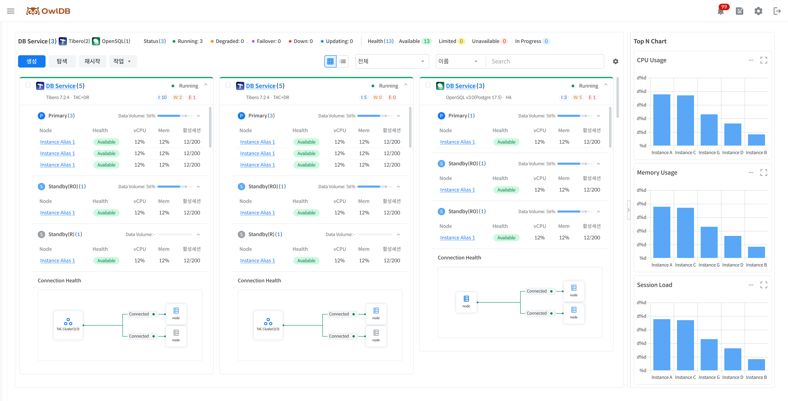

Provides summary information and notifications about the status of all operating databases and instances. **OwlDB Console Screen > OwlDB Logo**Click to check the dashboard.

<figure>

<figcaption>Figure 1. Dashboard</figcaption>
</figure>

# Checking Overall Status Summary Information

For all operating databases/instances, the top-level status value (**Status**) and detailed status value (**Health**) are checked. When you click each status, '[DB Service/Instance List Check](#db-service인스턴스-목록-확인)', you can view the list of DB Services/instances with the corresponding status value.



Status, the top-level state, is displayed per database.

- Because the status can change for each instance node, the count is displayed next to the status in (n/m) format. n: number of available instance nodes m: total number of instance nodes
- Types displayed in Bold with `*`appended can be filtered in the dashboard.

| Type | Description |
| --- | --- |
| Deploying | Installing new resources |
| Registering | Registering new resources |
| **Running** * | Database available for normal use |
| **Updating** * | Applying planned operations/changes to the database (e.g., full restart, role switchover, spec change, migration, recovery, etc.) |
| **Degraded** * | Some databases/components unavailable (e.g., individual instance restart, etc.) |
| **Failover** * | Performing Auto Failover due to database failure detection (occurs when the entire Primary DB cluster is Unavailable) |
| **Down** * | Entire database unavailable (both Primary and Standby unavailable) |
| Starting | Transitioning from Stopped to Running |
| Stopping | Transitioning from Running to Stopped (full DB shutdown) |
| Stopped | All resources temporarily unused (resources deactivated) |
| Unregistering | Deregistering a registered DB Service (excluded from management targets upon completion) |
| Terminating | Permanently deleting all resources/data (access/recovery not possible upon completion) |

*표기는 필수 입력 항목을 의미합니다.

* indicates a required input field.


Health, the detailed state, is displayed per instance node.

- Displayed by combining the DB Boot Mode, Instance, cluster management tool (hereinafter CMT), and Agent connection status.
- The functions restricted according to the message can be checked via a banner when entering each menu.

The Health determination criteria for each engine are as follows.

- Tibero: Determined by combining the DB Boot Mode, cluster management tool (CMT), and Agent status.
- OpenSQL: Determined by combining the Patroni, OpenProxy, etcd, and Agent status.



| Display | Status | Message | Description |
| --- | --- | --- | --- |
| 🟢 Available | available | - | Node normal |
| 🟡 Limited | limited | Issue: CMT Inactive | Cluster management tool (CMT) abnormal |
|   | limited | Issue: Mount Mode | Node started in Mount mode |
| 🔴 Unavailable | unavailable | Issue: Nomount Mode | Node started in Nomount mode |
|   | unavailable | Issue: DB Down | Node DB Down |
|   | unavailable | Issue: Agent Disconnect | Agent connection lost with the VM where the node is located |
|   | unavailable | Issue: VM Down | VM where the node is located Down |
| ⚫ Retired | retired | Issue: Failovered Primary | Performing Failover (former) Primary abnormally terminated |


The Health of an OpenSQL instance node is determined by combining the Patroni, OpenProxy, etcd, and Agent status.

| Display | Status | Message | Description |
| --- | --- | --- | --- |
| 🟢 Available | available | - | Node normal |
| 🟡 Limited | limited | Issue: etcd Inactive | etcd abnormal |
|   | limited | Issue: OpenProxy Inactive | OpenProxy abnormal |
| 🔴 Unavailable | unavailable | Issue: DB Down | DB Down due to Patroni abnormal |
|   | unavailable | Issue: Agent Disconnect | Agent connection lost with the VM where the node is located |



`🔵 In Progress` Status applies commonly to both Tibero and OpenSQL.

| Level | Message |
| --- | --- |
| Individual instance node | Reboot, Switchover, Failover, Rebuilding, Modify Spec (TAC Scale In/Out) |
| All instances | Modify Spec (Scale Up/Down), Migration, Restoring, Patch/Upgrade, Starting, Stopping |


**Note**

A cluster management tool is a component required to operate a database in a cluster configuration. (e.g., Tibero Cluster Manager (CM), Tibero Active Storage (TAS), etc.)




# DB Service/Instance List Check

View the entire list of DB Services and their sub-instances. '[Checking Overall Status Summary Information](#전체-상태-요약-정보-확인)', the list of DB Services and instances displayed varies according to the selected status value.

- You can perform restart operations on the sub-instances of the selected database.
- You can perform start, stop, delete, role switchover, and license renewal management operations on the selected database.
- Provides a database/instance alias search function.


**Note**

You can perform various management operations on the DB Service. For details, **Operations** you can check on the page.


### List view toggle (card view/list view)

You can view the DB Service/instance list in two ways: card view and list view. When switching views, the sort function is reset, but filtering is retained.



Card view displays the key information of a DB Service in individual card form to make it easy to grasp visually. Up to 4 cards are displayed per row, and the size of each card is fixed. If the content exceeds the fixed size, internal scrolling is enabled. The last slot in the currently operating DB Service card list displays an `➕` icon, which navigates to the DB Service creation page when clicked.

<table><thead><tr><th>Item</th><th>Description</th></tr></thead><tbody><tr><td>DB Service Information</td><td>Summarizes and displays the key information of the database at the top of the card Display items<ul><li>DB Type Logo</li><li>DB Service Name</li><li>Status</li><li>DB Type</li><li>DB version (for OpenSQL, the OpenSQL version and PostgreSQL version are displayed simultaneously)</li><li>Topology</li><li>Eventlog : I / W / E (Info / Warning / Error, respectively)</li></ul></td></tr><tr><td>Node Information</td><td>Displays instance information linked under the database. Can be collapsed/expanded in accordion form based on Role Sort rules<ul><li>Tibero: Displayed in the order Primary → Standby(Read Only) → Standby(Recovery)</li><li>OpenSQL: Displayed in the order Leader → Replica</li><li>Sorted by AZ within the same Role Display items</li><li>Role : Displays the number of instances for that role</li><li>Data volume (Tibero) / Volume (OpenSQL): Displays usage (%), bar chart, and Threshold Table items</li><li>Instance alias</li><li>Health</li><li>vCPU: Current CPU usage (%)</li><li>Memory: Current memory usage (%)</li><li>Active sessions: Current number of active sessions / Max Session Count (not displayed for Standby(Recovery))</li><li>Availability zone: AZ information where the instance is located</li></ul></td></tr><tr><td>Cluster Information</td><td>Displays Connection Health as a cluster diagram<ul><li>Single: Displays only Primary/Leader DB information</li><li>Single +DR / HA: Displays Primary/Leader DB and Standby/Replica DB information. Displays P-S connection status monitoring information; Standby/Replica DBs are each created per AZ</li><li>Tibero TAC: Displays multiple nodes within the Primary DB Box</li><li>Tibero TAC + DR: Displays Primary DB and Standby DB information. Displays P-S connection status monitoring information, displays multiple nodes within the Primary DB Box, and Standby DBs are each created per AZ</li><li>DR configuration connection status monitoring: Represents the connection status between Primary - Standby / Leader - Replica through line colors and displayed information</li><li>Normal: green,<code>Connected</code></li><li>Failed: red,<code>Disconnected</code></li></ul></td></tr></tbody></table>


The list view displays database and sub-instance information in a tree-shaped table to make it easy to understand the hierarchical structure.


**Note**

'Default value' refers to items exposed by default on the initial screen, and 'Required value' refers to items that cannot be hidden.


<table><thead><tr><th>Column</th><th>Description</th><th>DB Service level</th><th>Instance level</th><th>Default value</th><th>Required value</th></tr></thead><tbody><tr><td><strong>Name</strong></td><td>Name display<ul><li>When clicking the DB Service name, navigate to the '<a href="https://github.com/hhjinn/gitbookPAT/tree/dori/SNGSMUVdPJMBNhWqlXnC/doc/5d7daeb2-e4f4-4409-aa74-dcaf1d65ab46/README.md">Service meta information lookup</a>' page</li><li>When clicking the instance alias, navigate to the '<a href="https://github.com/hhjinn/gitbookPAT/tree/dori/SNGSMUVdPJMBNhWqlXnC/doc/dF57s45IXBUgU7RX1UvL/README.md">Instance management</a>' page</li></ul></td><td>DB Service name</td><td>Instance alias</td><td>O</td><td>O</td></tr><tr><td><strong>Creation date</strong></td><td>Displays the DB Service creation date in <code>yyyy.mm.dd HH\:mm:ss</code> format</td><td>DB Service creation date</td><td>X</td><td>X</td><td>X</td></tr><tr><td><strong>Status</strong></td><td>Displays Status or Health</td><td><ul><li>Creating</li><li>Running(n/m)</li><li>Updating(n/m)</li><li>Degraded(n/m)</li><li>Failover(n/m)</li><li>Down(n/m)</li><li>Starting</li><li>Stopping</li><li>Stopped</li><li>Terminating</li><li>Deploying (on-premise)</li><li>Registering (on-premise)</li><li>Unregistering (on-premise)</li></ul></td><td><ul><li>🟢 (available)</li><li>🟡 (limited)</li><li>🔵 (in progress)</li><li>🔴 (unavailable)</li></ul></td><td>O</td><td>O</td></tr><tr><td><strong>Type</strong></td><td>Displays the database engine type</td><td><ul><li>Tibero</li><li>OpenSQL</li></ul></td><td>-</td><td>O</td><td>X</td></tr><tr><td><strong>Configuration</strong></td><td>Displays topology or role</td><td><ul><li>Tibero: Single, TAC(+DR)</li><li>OpenSQL: Single, HA</li></ul></td><td><ul><li>Tibero: Primary, Standby(Read Only), Standby(Recovery)</li><li>OpenSQL: Leader, Replica</li></ul></td><td>O</td><td>O</td></tr><tr><td><strong>Availability Zone (Cloud)</strong></td><td>In a Cloud environment, displays the availability zone (AZ) information where the corresponding instance is located</td><td>-</td><td>Availability zone (AZ) information</td><td>O</td><td>X</td></tr><tr><td><strong>vCPU</strong></td><td>Displays the CPU count and usage as a bar chart</td><td>O</td><td>O</td><td>O</td><td>X</td></tr><tr><td><strong>Memory</strong></td><td>Displays Memory and usage as a bar chart</td><td>O</td><td>O</td><td>O</td><td>X</td></tr><tr><td><strong>Active sessions</strong></td><td>Displays the number of currently active sessions as a bar chart<ul><li>Displayed only for Primary / Standby(RO) / Leader / Replica</li><li>Standby(Recovery) :<code>-</code>Displayed as</li></ul></td><td>O</td><td>O</td><td>O</td><td>X</td></tr><tr><td><strong>Data Volume (Tibero/OpenSQL)</strong></td><td>Displays data volume usage as a bar chart + displays Threshold</td><td>O</td><td>X</td><td>O</td><td>X</td></tr><tr><td><strong>Redo log Volume (Tibero)</strong></td><td>Displays redo log volume usage as a bar chart</td><td>O</td><td>X</td><td>X</td><td>X</td></tr><tr><td><strong>Archive log Volume (Tibero)</strong></td><td>Displays archive log volume usage as a bar chart</td><td>O</td><td>X</td><td>X</td><td>X</td></tr><tr><td><strong>Root Volume</strong></td><td>Displays Root volume usage as a bar chart</td><td>O</td><td>O</td><td>X</td><td>X</td></tr></tbody></table>



### DB Service List user settings

The ⚙️ at the top right of the DB Service List screen **Settings** Clicking the icon allows you to configure the screen display method to suit your environment.

- Card View : Configures the information areas displayed on the card.
- List View : Configures the columns displayed in the list.

The configured settings are saved per user and are applied consistently thereafter.



In Card View, you can select the information areas to display on the card.

1. On the DB Service List screen, click ⚙️ **Settings**Click it.
2. **Configuration**Toggle the items to display ON/OFF.
3. On the right **Preview**Preview the changes.
4. **Save**Click to apply.

### Setting items

| Item | Description |
| --- | --- |
| DB Service Info | Displays DB Service basic information |
| Node Info | Displays status and resource information per node |
| Cluster Info | Displays Cluster information and Connection Health |


**Note**

You can check the change results in real time in the Preview area on the right. They are not applied to the actual screen until saved.



In List View, you can select the columns to display in the list or change the column order.

1. On the DB Service List screen, click ⚙️ **Settings**Click it.
2. Toggle the columns to display ON/OFF.
3. Change the column order via Drag & Drop.
4. **Save**Click to apply.

### Key Features

| Feature | Description |
| --- | --- |
| Column show/hide | Set whether to display columns using the switch |
| Column search | Quickly find the desired item by searching the column name |
| Change column order | Drag to change to the desired order |
| Reset to default values | Restore to the default column configuration |



# Top N chart lookup

On the dashboard screen, check the top instances based on CPU Usage, Memory Usage, and Session Load as charts for the DB Services for which you have lookup permission. The Top N chart is exposed in the right area of the dashboard, and data is automatically configured to match the lookup permission scope of the logged-in user without any separate configuration. If there are no DB Services for which you have lookup permission, a no-data state is displayed in the chart area.


**Note**

**Differences in supported engines by environment**

- AWS environment: Only Tibero engine instances are included in the lookup targets.
- Azure environment: Both Tibero and OpenSQL engine instances are included in the lookup targets.


### Display metrics

<table><thead><tr><th>Metric</th><th>Description</th></tr></thead><tbody><tr><td>CPU Usage</td><td>Chart of the top 5 instances based on CPU usage<ul><li>Targets all instances regardless of engine type</li><li>X-axis: Instance Alias</li><li>Display data label (%)</li></ul></td></tr><tr><td>Memory Usage</td><td>Chart of top 5 instances by Memory usage<ul><li>Targets all instances regardless of engine type</li><li>X-axis: Instance Alias</li><li>Display data label (%)</li></ul></td></tr><tr><td>Session Load</td><td>Chart of top 5 instances by Session Load (%)<ul><li>Metric indicating the ratio of Active Session to Max Session</li><li>X-axis: Instance Alias</li><li>Display data label (%)</li><li>Tooltip: (Active Session/Max Session)X100</li></ul></td></tr></tbody></table>

### Expand/collapse chart area

Clicking the button at the top of the Top N chart area collapses or expands the chart area.

- The default state is expanded.
- If the user changes it to the collapsed state, the collapsed state is maintained even after navigating to another screen within the same session and returning.
- When you log out or the session ends and you connect with a new session, it resets to the expanded state.
