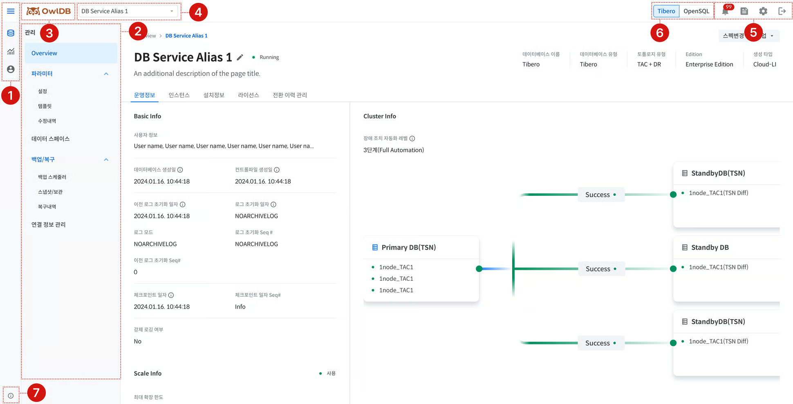

<figure>

<figcaption>Figure 1. Console screen components</figcaption>
</figure>

This describes the components and functions of each area of the console screen.

<table><thead><tr><th>Element</th><th>Description</th></tr></thead><tbody><tr><td>① GNB - Menu</td><td><ul><li>Hamburger menu: Function to open and close the menu panel</li><li>Menu icon: Main function to open and close the detailed menu area</li></ul></td></tr><tr><td>② Detailed menu area</td><td><ul><li>Displays the submenu list for the selected menu icon</li><li>Page-to-page navigation function</li></ul></td></tr><tr><td>③ Logo</td><td>Moves to the <strong>Dashboard</strong> page</td></tr><tr><td>④ DB / Instance selection</td><td><ul><li>Selects the database and instance to manage and monitor</li><li>Selectable items may vary by function (see '<a href="https://github.com/hhjinn/gitbookPAT/tree/dori/TgpIeVAAe6TUtfrjaD2G/getting-started/undefined-2.md#IAtHKOuaikB0qe5kmvf4">Feature-specific Usage Guide</a>')</li></ul></td></tr><tr><td>⑤ GNB - Others</td><td><ul><li>Notification center</li><li>User guide</li><li>User settings (language, theme)</li><li>Logout</li></ul></td></tr><tr><td>⑥ Table settings</td><td><ul><li>Function to select and deselect table fields to display on the screen</li><li>Adjust the order of table fields</li></ul></td></tr><tr><td>⑦ Info</td><td>Version and release information</td></tr></tbody></table>

<table><thead><tr><th>Element</th><th>Description</th></tr></thead><tbody><tr><td>① GNB - Menu</td><td><ul><li>Hamburger menu: Function to open and close the menu panel</li><li>Menu icon: Main function to open and close the detailed menu area</li></ul></td></tr><tr><td>② Detailed menu area</td><td><ul><li>Displays the submenu list for the selected menu icon</li><li>Page-to-page navigation function</li></ul></td></tr><tr><td>③ Logo</td><td>Moves to the <strong>Dashboard</strong> page</td></tr><tr><td>④ DB / Instance selection</td><td><ul><li>Selects the database and instance to manage and monitor</li><li>Selectable items may vary by function (see '<a href="https://github.com/hhjinn/gitbookPAT/tree/dori/TgpIeVAAe6TUtfrjaD2G/getting-started/undefined-2.md#IAtHKOuaikB0qe5kmvf4">Feature-specific Usage Guide</a>')</li></ul></td></tr><tr><td>⑤ GNB - Others</td><td><ul><li>Notification center</li><li>User guide</li><li>User settings (language, theme)</li><li>Logout</li></ul></td></tr><tr><td>⑥ DB engine selection</td><td><ul><li>Function to select the DB engine to display on the screen</li><li>Changes the DB Service list in the DB/Instance selection dropdown according to the selected DB engine</li></ul></td></tr><tr><td>⑦ Info</td><td>Version and release information</td></tr></tbody></table>

<figure>

<figcaption>Figure 2. Table settings</figcaption>
</figure>

<table><thead><tr><th>Element</th><th>Description</th></tr></thead><tbody><tr><td>① Table settings</td><td><ul><li>Function to select and deselect table fields to display on the screen</li><li>Adjust the order of table fields</li></ul></td></tr></tbody></table>
