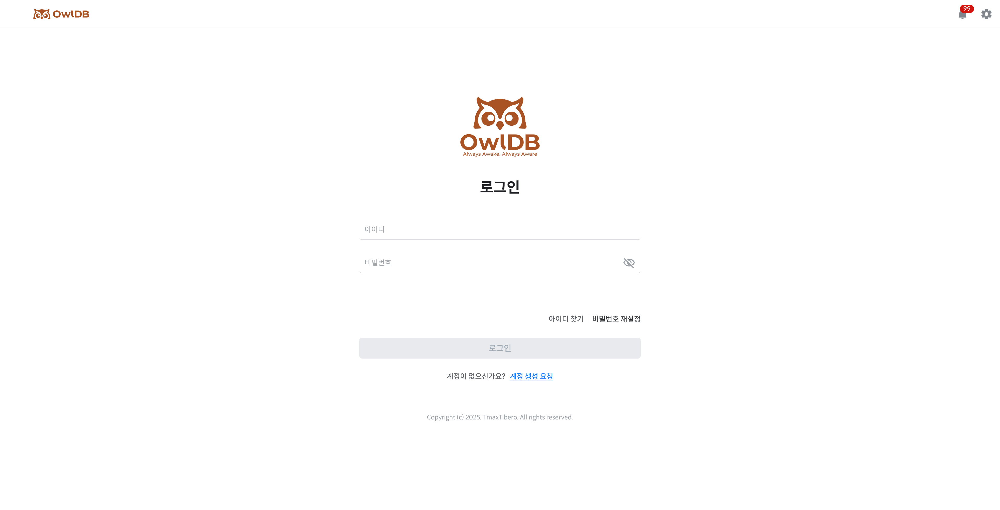

<figure>

<figcaption>Figure 1. Login</figcaption>
</figure>

## Root first login 

Once OwlDB deployment is complete, the Root account information is sent to the email address entered when creating the stack.

| Item | Initial value |
| --- | --- |
| ID | admin or a user-entered value |
| Password | Temporary password |

1. Go to the connection URL listed in the email.
2. Enter the Root account and temporary password received in the email.
3. Click the **Login** button.
4. On first login, you are automatically redirected to the **Change Password** page for security reasons.
5. Enter a new password.
6. Change the password.
7. Log in again with the changed password.


**Caution**

- Be sure to change the password after your first login.
- You cannot navigate to other pages until you change the password.


---

## Login 

On the **Login** page, enter your account information to connect to OwlDB.

1. On the **Login** page, enter your ID and password.
2. Click the **Login** button.
3. Once authentication is complete, you are redirected to the **Dashboard** page.


**Note**

If you do not have a Member account, you can request account creation by clicking the **Request Account Creation** button on the **Login** page. For details, refer to Request Account Creation.


---

## Finding your ID 

If you have forgotten your ID, you can check your ID through your registered email address.


**Note**

The Find ID feature is provided only in the Cloud environment.


1. On the **Login** page, click **Find ID**.
2. Enter your registered email address.
3. Click **Send Email**.
4. Once the entered email address is verified, an email with your ID is sent.
5. Click **Log In** to go to the **Login** page.

### Email verification criteria by account 

| Account | Email to be entered |
| --- | --- |
| Root | Email address entered when subscribing to OwlDB |
| Member | Email address registered to the account |


**Note**

If the entered email address does not match the registered information, the ID cannot be found.


## ID notification email 

Once email verification is complete, an ID notification email is sent to the registered email address.

The email includes the following information.

- ID
- Shortcut to the OwlDB **Login** page

After receiving the email, click **Go to OwlDB** or move to the **Login** page and log in with the provided ID.

### If you did not receive the email 

If the ID notification email has not arrived, you can resend it by clicking **Resend Email**.


**Note**

The email can be resent up to 5 times within 10 minutes. If the resend limit is exceeded, you must try again after a certain period of time.


---

## Reset password 

If you have forgotten your password, you can verify your registered account information, receive a temporary password, and change it to a new password.


**Note**

The password reset feature is only provided in the Cloud environment.


### Issuing a temporary password 

1. On the **Login** page, click **Reset Password**.
2. Enter your ID and registered email address.
3. Click **Send Email**.
4. Once the entered account information is verified, a temporary password is sent to the registered email address.
5. Click **Log In** to go to the **Login** page.


**Note**

If the entered ID and email address do not match the registered information, a temporary password cannot be issued.


## Logging in with a temporary password 

1. Check the **temporary password** in the email.
2. On the **Login** page, enter your ID and the temporary password.
3. Click **Login**.
4. You are automatically moved to the **Reset Password** page.


**Caution**

If you logged in with a temporary password, you cannot use other pages until you change your password.


## Change password 

1. Enter a new password.
2. Re-enter the password to confirm it.
3. Click **Change Password**.
4. Once the password change is complete, you are moved to the **Login** page.
5. Log in again with the changed password.


**Note**

You cannot use a password that is the same as your existing password.

