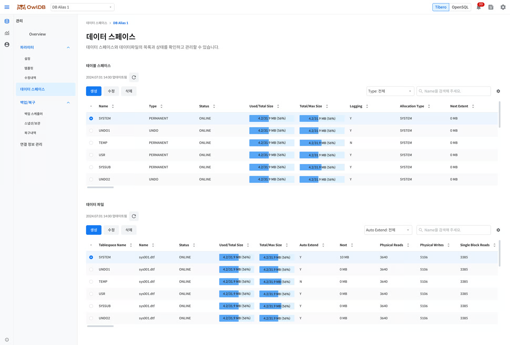

View, create, modify, and delete the storage space (tablespaces and data files) of databases operating in OwlDB. A single tablespace can contain multiple data files.


**Note**

- Tablespaces can only be viewed, modified, and deleted when the database status is `Running`.
- If the DB engine is set to OpenSQL, the database management screen is displayed instead of this page.


<figure>

<figcaption>Figure 1. Data Space - Tibero</figcaption>
</figure>

# Viewing Tablespaces 

1. Go to the **OwlDB Console Screen > Management > Tablespaces** menu.
2. Click the **DB Alias** dropdown button to select the database whose tablespaces you want to view.
3. View the tablespace list. You can filter the list by type. You can search directly by name.

<table><thead><tr><th>Item</th><th>Description</th></tr></thead><tbody><tr><td>Name</td><td>Tablespace Name</td></tr><tr><td>Type</td><td>Tablespace Type<ul><li><strong>Permanent</strong>: Stores permanent data; generally the most commonly used type</li><li><strong>Temporary</strong>: Stores temporary data; data is deleted when the session ends or the task is completed</li><li><strong>Undo</strong>: Stores data for modified data</li></ul></td></tr><tr><td>Status</td><td>Tablespace Status<ul><li><strong>ONLINE</strong>: A state in which it is normally connected to the database and available for use</li><li><strong>OFFLINE</strong>: A state in which it is disconnected from the database (objects stored in the tablespace cannot be accessed)</li></ul></td></tr><tr><td>Used/Total Size</td><td><ul><li><strong>Used Size</strong>: The total space used by the data files belonging to the tablespace</li><li><strong>Total Size</strong>: The total space allocated to the data files belonging to the tablespace</li></ul></td></tr><tr><td>Total/Max Size</td><td><ul><li><strong>Total Size</strong>: The total space allocated to the data files belonging to the tablespace</li><li><strong>Max Size</strong>: The total maximum space that can be allocated to the data files belonging to the tablespace</li></ul></td></tr><tr><td>Logging</td><td>Logging Status</td></tr><tr><td>Allocation Type</td><td>Extent Allocation Method<ul><li><strong>SYSTEM</strong>: A method that dynamically allocates extent sizes according to system demand</li><li><strong>UNIFORM</strong>: A method that stores objects using extents of the same size</li></ul></td></tr><tr><td>Next Extent</td><td>Next Allocated Extent Size</td></tr></tbody></table>

---

# Creating a Tablespace 

1. Go to the **OwlDB Console Screen > Management > Tablespaces** menu.
2. Click the **DB Alias** dropdown button to select the database in which to create the tablespace.
3. Click the **Create** button.


**Note**

Based on a data block size of 8KB, even if UNIFORM SIZE is set smaller than 128KB, it is set to the minimum extent size of 128KB.


---

# Modifying a Tablespace 

1. Go to the **OwlDB Console Screen > Management > Tablespaces** menu.
2. Click the **DB Alias** dropdown button to select the database whose tablespace you want to modify.
3. Click the **Edit** button.

---

# Deleting a Tablespace 

1. Go to the **OwlDB Console Screen > Management > Tablespaces** menu.
2. Click the **DB Alias** dropdown button to select the database whose tablespace you want to delete.
3. Click the **Delete** button.

---

# Viewing Data Files 

1. Refer to '[Viewing Tablespaces](#view-tablespaces)' to select the database whose data files you want to view.
2. Click the **Tablespace** radio button to select the tablespace whose data files you want to view.
3. View the data file list. You can filter the list by auto-extend status. You can search directly by data file name.

<table><thead><tr><th>Item</th><th>Description</th></tr></thead><tbody><tr><td>Tablespace Name</td><td>Tablespace Name</td></tr><tr><td>Name</td><td>Data File Name</td></tr><tr><td>Online Status</td><td>Data File Status<ul><li><strong>SYSOFF</strong>: System offline file</li><li><strong>SYSTEM</strong>: System online file</li><li><strong>OFFLINE</strong>: Offline state</li><li><strong>ONLINE</strong>: Online state</li><li><strong>RECOVER</strong>: A state requiring recovery</li><li><strong>AVAILABLE</strong>: Available state</li></ul></td></tr><tr><td>Used/Total Size</td><td><ul><li><strong>Used Size</strong>: The amount of space used by the data file</li><li><strong>Total Size</strong>: The amount of space allocated to the data file</li></ul></td></tr><tr><td>Total/Max Size</td><td><ul><li><strong>Total Size</strong>: The amount of space allocated to the data file</li><li><strong>Max Size</strong>: The maximum amount of space that can be allocated to the data file</li></ul></td></tr><tr><td>Auto Extend</td><td>Auto-Extend Status</td></tr><tr><td>Next</td><td>Next Extension Size</td></tr><tr><td>Physical Reads</td><td>Physical Read Count</td></tr><tr><td>Physical Writes</td><td>Physical Write Count</td></tr><tr><td>Single Block Reads</td><td>Single Block Read Count</td></tr></tbody></table>

---

# Creating a Data File 

1. Refer to '[Viewing Data Files](#view-data-files)' to select the tablespace in which to create the data file.
2. Click the **Create** button.

---

# Modifying a Data File 

1. Refer to '[Viewing Data Files](#view-data-files)' to select the tablespace whose data file you want to modify.
2. Click the **Edit** button.

---

# Deleting a Data File 

1. Refer to '[Viewing Data Files](#view-data-files)' to select the tablespace whose data file you want to delete.
2. Click the **Delete** button.
