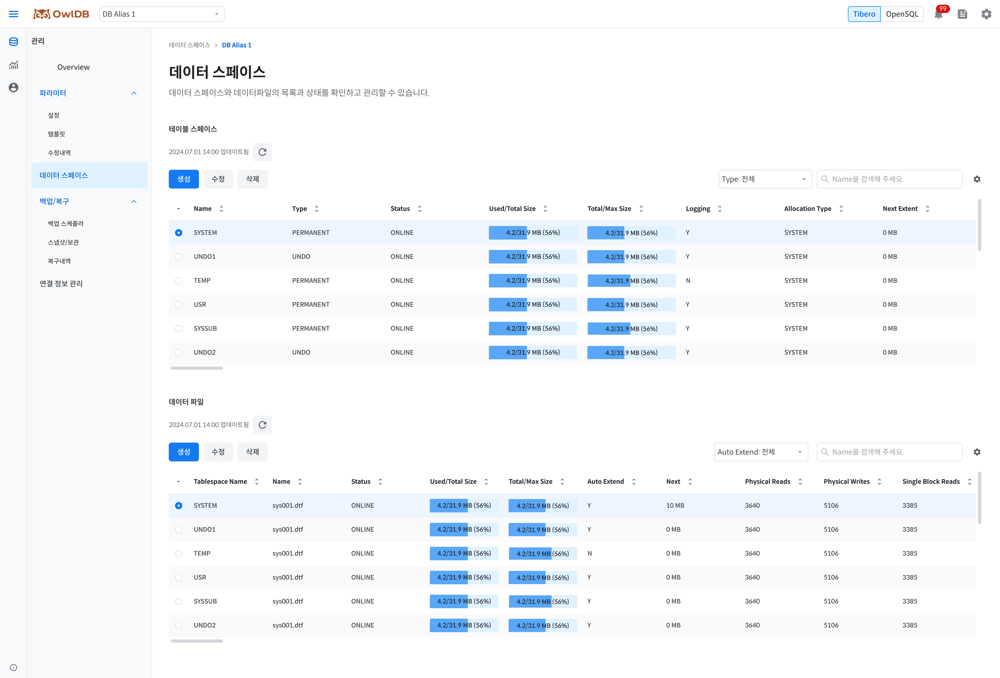

View, create, modify, and delete the storage space (tablespaces and data files) of databases running in OwlDB. One tablespace can contain multiple data files.


**Note**

- Only when the database status is `Running`can tablespaces be viewed, modified, and deleted.
- When the DB engine is set to OpenSQL, the database management screen is displayed instead of this page.


<figure>

<figcaption>Figure 1. Data Space - Tibero</figcaption>
</figure>

# Viewing Tablespaces 

1. **OwlDB Console Screen > Management > Tablespaces** Go to the menu.
2. **DB Alias** Click the dropdown button to select the database whose tablespaces you want to view.
3. View the tablespace list. You can filter the list by type. You can also search directly by name.

<table><thead><tr><th>Item</th><th>Description</th></tr></thead><tbody><tr><td>Name</td><td>Tablespace name</td></tr><tr><td>Type</td><td>Tablespace type<ul><li><strong>Permanent</strong>: Stores permanent data and is generally the most commonly used type</li><li><strong>Temporary</strong>: Stores temporary data, which is deleted when the session ends or the task is completed</li><li><strong>Undo</strong>: Stores modified data</li></ul></td></tr><tr><td>Status</td><td>Tablespace status<ul><li><strong>ONLINE</strong>: A state in which it is normally connected to the database and available for use</li><li><strong>OFFLINE</strong>: A state in which the connection to the database is lost (objects stored in the tablespace cannot be accessed)</li></ul></td></tr><tr><td>Used/Total Size</td><td><ul><li><strong>Used Size</strong>: The total amount of space in use by the data files belonging to the tablespace</li><li><strong>Total Size</strong>: The total amount of space allocated to the data files belonging to the tablespace</li></ul></td></tr><tr><td>Total/Max Size</td><td><ul><li><strong>Total Size</strong>: The total amount of space allocated to the data files belonging to the tablespace</li><li><strong>Max Size</strong>: The total amount of space that the data files belonging to the tablespace can be allocated at maximum</li></ul></td></tr><tr><td>Logging</td><td>Logging status</td></tr><tr><td>Allocation Type</td><td>Extent allocation method<ul><li><strong>SYSTEM</strong>: A method that dynamically allocates extent sizes according to system requirements</li><li><strong>UNIFORM</strong>: A method that stores objects using extents of the same size</li></ul></td></tr><tr><td>Next Extent</td><td>Next allocated extent size</td></tr></tbody></table>

---

# Creating a Tablespace 

1. **OwlDB Console Screen > Management > Tablespaces** Go to the menu.
2. **DB Alias** Click the dropdown button to select the database in which to create the tablespace.
3. **Create** Click the button.


**Note**

Based on a data block size of 8KB, even if UNIFORM SIZE is set to less than 128KB, it is set to 128KB, the minimum extent size.


---

# Modifying a Tablespace 

1. **OwlDB Console Screen > Management > Tablespaces** Go to the menu.
2. **DB Alias** Click the dropdown button to select the database whose tablespace you want to modify.
3. **Edit** Click the button.

---

# Deleting a Tablespace 

1. **OwlDB Console Screen > Management > Tablespaces** Go to the menu.
2. **DB Alias** Click the dropdown button to select the database whose tablespace you want to delete.
3. **Delete** Click the button.

---

# Viewing Data Files 

1. '[Viewing Tablespaces](#view-tablespaces)Refer to ' to select the database whose data files you want to view.
2. **Tablespace** Click the radio button to select the tablespace whose data files you want to view.
3. View the data file list. You can filter the list by auto-extend status. You can also search directly by data file name.

<table><thead><tr><th>Item</th><th>Description</th></tr></thead><tbody><tr><td>Tablespace Name</td><td>Tablespace name</td></tr><tr><td>Name</td><td>Data file name</td></tr><tr><td>Online Status</td><td>Data file status<ul><li><strong>SYSOFF</strong>: System offline file</li><li><strong>SYSTEM</strong>: System online file</li><li><strong>OFFLINE</strong>: Offline status</li><li><strong>ONLINE</strong>: Online status</li><li><strong>RECOVER</strong>: Status requiring recovery</li><li><strong>AVAILABLE</strong>: Available status</li></ul></td></tr><tr><td>Used/Total Size</td><td><ul><li><strong>Used Size</strong>: The capacity of space currently in use by the data file</li><li><strong>Total Size</strong>: The capacity of space allocated to the data file</li></ul></td></tr><tr><td>Total/Max Size</td><td><ul><li><strong>Total Size</strong>: The capacity of space allocated to the data file</li><li><strong>Max Size</strong>: The maximum capacity of space that can be allocated to the data file</li></ul></td></tr><tr><td>Auto Extend</td><td>Auto-extension enabled</td></tr><tr><td>Next</td><td>Next extension size</td></tr><tr><td>Physical Reads</td><td>Physical read count</td></tr><tr><td>Physical Writes</td><td>Physical write count</td></tr><tr><td>Single Block Reads</td><td>Single block read count</td></tr></tbody></table>

---

# Create data file 

1. '[Viewing Data Files](#view-data-files)' to select the tablespace in which to create the data file.
2. **Create** Click the button.

---

# Modify data file 

1. '[Viewing Data Files](#view-data-files)' to select the tablespace in which to modify the data file.
2. **Edit** Click the button.

---

# Delete data file 

1. '[Viewing Data Files](#view-data-files)' to select the tablespace from which to delete the data file.
2. **Delete** Click the button.
