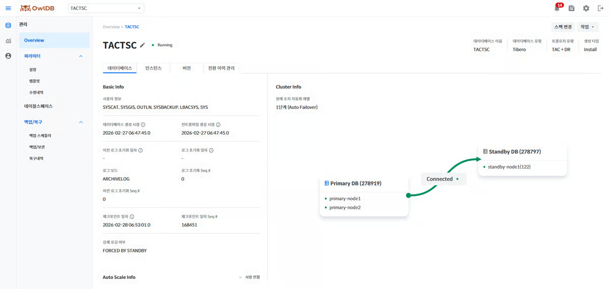
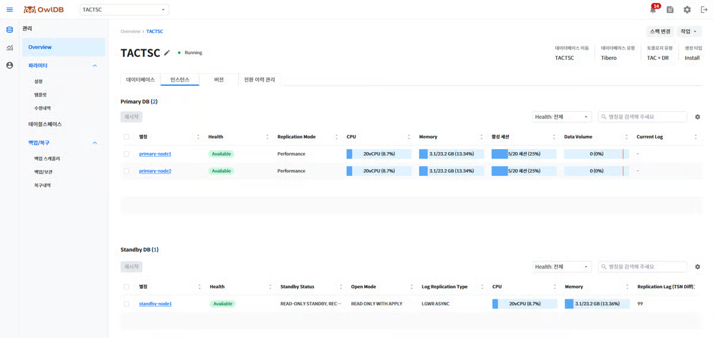

View the status of databases running in OwlDB, and perform operations such as modify, stop, start, delete, role switchover, license renewal, and spec change.


**Note**

- If the instance status is not `Running`, some information may be missing.
- The database management page displays times based on the database timezone, so there may be a difference from your local system time (browser time).


---

## Viewing database information 

1. Click the **Management > Overview** menu.
2. Click the **DB Service Alias** dropdown button and select the database whose information you want to view.
3. Check the detailed information in the Operation Information, Instance, Installation Information, (DR/HA) Switchover History Management, and (BYOL) License tabs.


**Note**

You can check the database operational status on the **Overall Status Summary** page.



**Note**

If you are using the BYOL license model and the license expiration date is within 3 months, an expiration notice banner is displayed at the top of the screen. Clicking the **Go to Renewal Page** link in the banner takes you to the license renewal screen.




<figure>

<figcaption>Figure 1. Operation Information</figcaption>
</figure>

You can check detailed database information such as account information that can access the database, control files, logs, and checkpoints, and you can visually check the database configuration as a diagram.


**Note**

All items that display a date and time are shown based on the database timezone.



<figure>

<figcaption>Figure 2. Instance</figcaption>
</figure>

Check the list of configured instances and their information.

- Clicking an **instance alias** takes you to the "[Instance Management](#dF57s45IXBUgU7RX1UvL)" page.
- You can first select one or more instances with the ☑️ icon and then click the **Restart** button, or click the **Restart** button directly without any selection to choose the instances to restart and the restart options in the modal that opens. For more details, refer to "[Restarting an Instance](#undefined-2)".


**Note**

If you use a DR configuration, the Primary (Leader) DB and the Standby (Replica) DB are viewed separately.



Check the database version information, system and compilation information, and patch (or Extension) information.

The system and compilation information displays binary OS information and so on as a list regardless of the engine. Basic Info and patch information vary by engine as follows.

<table><thead><tr><th>Item</th><th>Tibero</th><th>OpenSQL</th></tr></thead><tbody><tr><td>Basic Info</td><td><ul><li>Major version</li><li>Minor version</li><li>Patchset version</li></ul></td><td><ul><li>OpenSQL version (e.g., 3.0)</li><li>PostgreSQL version (e.g., 17.5)</li></ul></td></tr><tr><td>System and compilation information</td><td>Displays binary OS information and so on as a list</td><td>Displays binary OS information and so on as a list</td></tr><tr><td>Patch information / Extensions</td><td><ul><li>Displays a list of the applied patch status</li><li>If there are none, displays the message "There are no applied patches"</li></ul></td><td><ul><li>Displays a list of currently installed Extensions</li><li>Extensions added via DDL during operation are also reflected as of the time of the query</li></ul></td></tr></tbody></table>


**Note**

Items whose value cannot be retrieved are displayed as `-`.



This tab is provided in the BYOL license model.

- Check the license in use and the assigned instance information.
- You can also check information about expired licenses.


**Note**

If an idle license exists, you can use the **Rebuild** button to create instances and assign licenses according to the existing license configuration.



This tab is provided for a Tibero DR configuration or an OpenSQL HA configuration.

Check the history of database role switchover events that have occurred. When a switchover event completes, an entry is added to the history.

<table><thead><tr><th>Column name</th><th>Description</th><th>Data format</th><th>Default</th><th>Required</th></tr></thead><tbody><tr><td>ID</td><td><ul><li>A number that uniquely identifies the switchover event</li><li>Format: {event type-random string 16 bytes}</li><li>Event type: FO / SO / FB</li></ul></td><td><ul><li>FO-3f9a7c1e2d8b45f0</li><li>SO-b17e4a93d2c68f5e</li><li>FB-7a2d9e14c6b83f05</li></ul></td><td>O</td><td>X</td></tr><tr><td>Start time</td><td>The time at which the switchover event occurred</td><td>yyyy.mm.dd HH\:mm:ss</td><td>O</td><td>O</td></tr><tr><td>Completion time</td><td>The time at which the switchover event completed</td><td>yyyy.mm.dd HH\:mm:ss</td><td>X</td><td>X</td></tr><tr><td>Type</td><td>Switchover event type</td><td><ul><li>Failover</li><li>Switchover</li><li>Failback</li></ul></td><td>O</td><td>O</td></tr><tr><td>Performed by</td><td>The entity that performed the event</td><td><ul><li>Switchover: {user ID}</li><li>Failover: {user ID} / system (Auto Failover)</li><li>Failback: {user ID}</li></ul></td><td>O</td><td>X</td></tr><tr><td>Result</td><td>Displays the status of the event</td><td><ul><li>Success</li><li>Failure</li></ul></td><td>O</td><td>X</td></tr><tr><td>Cause/Remarks</td><td>Displays the cause of the event, the value entered by the user, or the failure reason</td><td><ul><li>A value optionally entered by the user during role switchover (up to 200 characters, blank if not entered)</li><li>Trigger conditions for Auto Failover</li><li>On Failback failure: Standby/Replica Reboot Failed or Switchover Failed</li><li>On Failover failure: Standby/Replica Promotion Failed</li><li>On post-processing failure after a successful Failover: Cluster Normalization Failed (Primary scale out failed / New Standby/Replica creation failed; if multiple failures, separated by commas)</li></ul></td><td>O</td><td>X</td></tr></tbody></table>



---

## Modifying DB Service information 

1. Click the **pencil icon** next to the DB Service alias.
2. Modify the DB Service alias and description.
3. Click the **Save** button.
