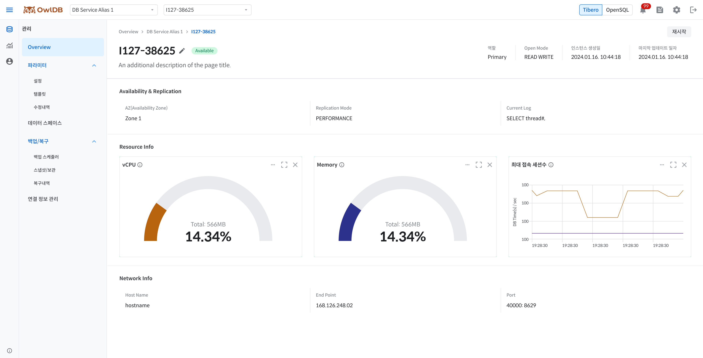

**OwlDB**You can monitor the status and resource usage of running instances and, if necessary, modify or restart instances. When the instance status is `Available`some information may be missing.


**Note**

- You can navigate to the instance management page from the dashboard via the following path. **[List view]** Arrow icon next to the database alias > Click the instance alias **[Card view]** Click the instance alias on the database card
- In an AWS environment, only the Tibero engine is supported.


## View instance list

1. **Management > Overview**to navigate to.
2. **Instance** Click the tab.
3. Check the status and resource usage of the instance you want to review in the list.

### Primary (Leader) DB display items



| Item | Description |
| --- | --- |
| Alias | Displays the instance alias (click to navigate to the detailed information page) |
| Creation date | Instance creation date and time (`yyyy-mm-dd HH:mm:ss`) |
| Health | Current status of the instance (Available / In Progress / Limited / Unavailable) |
| Open Mode | Operation mode of the DB (READ WRITE) |
| Replication Mode | Operation mode of the Primary DB (PERFORMANCE) |
| CPU | Bar chart of usage against provisioned vCPU |
| Memory | Bar chart of usage against provisioned memory |
| Active sessions | Bar chart of the number of active sessions |
| Data Volume | data volume usage (includes 90% threshold display) |
| Redo log Volume | redo log volume usage |
| Archive log Volume | archive log volume usage |
| Root Volume | root volume usage |
| Current Log | Most recent Redo log identifier value (displayed only when a Standby is configured) |


| Item | Description |
| --- | --- |
| Alias | Displays the instance alias (click to navigate to the detailed information page) |
| Creation date | Instance creation date and time (`yyyy-mm-dd HH:mm:ss`) |
| Health | Current status of the instance (Available / In progress / Limited / Unavailable) |
| Open Mode | Operation mode of the DB (READ WRITE) |
| CPU | Bar chart of usage against provisioned vCPU |
| Memory | Bar chart of usage against provisioned memory |
| Active sessions | Bar chart of the number of active sessions |
| Volume | Total and usage of OpenSQL volumes |
| Root Volume | root volume usage |
| Current Log | Most recent WAL log identifier value (LSN, displayed only when HA is configured) |



### Standby (Replica) DB display items



| Item | Description |
| --- | --- |
| Alias | Displays the instance alias (click to navigate to the detailed information page) |
| Creation date | Instance creation date and time (`yyyy-mm-dd HH:mm:ss`) |
| Health | Current status of the instance (Available / In progress / Limited / Unavailable / Retired) |
| Standby Status | `v$standby` Shown when queried `status` Displays the value |
| Open Mode | Operation mode of the DB (MOUNTED / RECOVERY / READ WRITE / READ ONLY / READ ONLY WITH APPLY) |
| Log Replication Type | Standby replication method (LGWR ASYNC / ARCH ASYNC) |
| CPU | Bar chart of usage against provisioned vCPU |
| Memory | Bar chart of usage against provisioned memory |
| Active sessions | Bar chart of the number of active sessions (displayed only when in Read Only status) |
| log last received | Redo log identifier value most recently received from the Primary (TSN value) |
| log last applied | Redo log identifier value most recently applied to the Standby (TSN value) |
| Replication Lag(seconds) | Replication lag time with the Primary DB |


| Item | Description |
| --- | --- |
| Alias | Displays the instance alias (click to navigate to the detailed information page) |
| Creation date | Instance creation date and time (`yyyy-mm-dd HH:mm:ss`) |
| Health | Current status of the instance (Available / In Progress / Limited / Unavailable) |
| Open Mode | Operation mode of the DB (READ ONLY) |
| Log Replication Type | Replica replication method (ASYNC / SYNC) |
| CPU | Bar chart of usage against provisioned vCPU |
| Memory | Bar chart of usage against provisioned memory |
| Active sessions | Bar chart of the number of active sessions (always displayed) |
| log last received | WAL log identifier value most recently received from the Leader (LSN value) |
| log last applied | WAL log identifier value most recently applied to the Replica (LSN value) |
| Replication Lag(seconds) | Replication lag time with the Leader DB |




**Caution**

If the instance status is not `Available`If not, a banner appears at the top of the screen to provide guidance on the current status.


## View instance detailed information

<figure>

<figcaption>Figure 1. Instance detailed information</figcaption>
</figure>

Clicking an alias in the instance list navigates to the detailed information page for that instance. The detail page is organized in the following order: top summary information, availability and replication information, resource usage status, network information, and database information.

1. On the Overview page **Instance** Click the tab.
2. Click the alias of the instance whose detailed information you want to view in the instance list.
3. On the detailed information page, check the top information, availability and replication information, resource usage information, network information, and database information.

### Top information

| Item | Description | Primary/Leader | Standby/Replica |
| --- | --- | --- | --- |
| Health | Instance status | Available / In progress / Limited / Unavailable | Common(Tibero includes Retired) |
| Role | Instance role | Tibero: Primary / OpenSQL: Leader | Tibero: Standby(Recovery/Read Only) / OpenSQL: Replica |
| Instance creation date | Creation date and time (`yyyy-mm-dd HH:mm:ss`) | Common | Common |
| Open Mode | DB Operation Mode | READ WRITE | Tibero: MOUNTED/RECOVERY/READ WRITE/READ ONLY/READ ONLY WITH APPLY, OpenSQL: READ ONLY |
| Last Updated Date | Configuration Change Date/Time (`yyyy-mm-dd HH:mm:ss`) | Common | Common |

### Availability and Replication Information

The Primary/Leader displays the items below, and the Standby/Replica additionally displays replication-related items for the same items.



| Item | Description | Display Target |
| --- | --- | --- |
| Replication Mode | Operation mode of the Primary DB (PERFORMANCE) | Primary |
| Current Log | Latest Redo log identifier value (TSN) | Common |
| Standby Status | Standby replication status (may differ per node) | Standby |
| Log Replication Type | Replication method (LGWR ASYNC / ARCH ASYNC) | Standby |
| log last received | Latest Redo log received from Primary (TSN) | Standby |
| log last applied | Latest Redo log applied to Standby (TSN) | Standby |
| Replication Lag(seconds) | Replication delay time with Primary | Standby |


| Item | Description | Display Target |
| --- | --- | --- |
| Current Log | Latest WAL log identifier value (LSN) | Common |
| Log Replication Type | Replication method (ASYNC / SYNC) | Standby |
| log last received | Latest WAL log received from Leader (LSN) | Replica |
| log last applied | Latest WAL log applied to Replica (LSN) | Replica |
| Replication Lag(seconds) | Replication delay time with Primary | Standby |



### Resource Usage Information

<table><thead><tr><th>Item</th><th>Description</th><th>Remarks</th></tr></thead><tbody><tr><td>CPU</td><td>Usage against provisioned vCPU (pie chart)</td><td>Refreshed every 5 seconds</td></tr><tr><td>Memory</td><td>Usage against provisioned memory (pie chart)</td><td>Refreshed every 5 seconds</td></tr><tr><td>Maximum number of connection sessions</td><td>Number of active sessions (line chart, refreshed every 5 seconds)</td><td><ul><li>Tibero Standby: Displayed only when in Read Only state</li><li>OpenSQL Replica: Always displayed</li></ul></td></tr></tbody></table>

### Network Information

| Item | Description |
| --- | --- |
| Host Name | Name of the host where the database server is running |
| End Point | Client connection address (Private IP) |
| Port | Database communication port number |

### Database Information


**Note**

Database information is provided only by the OpenSQL engine.


| Item | Description |
| --- | --- |
| Auto Vacuum | Whether Auto Vacuum is used (On / Off) |
| Database List | Displays sub-databases by Name, Data Size (GB), Active Sessions, Bloat Ratio (%), and Creation Date, and clicking the name navigates to the detailed information. |

The active session value is displayed based on the Primary node if the instance being queried is a Primary/Leader, and based on the Standby node if it is a Standby/Replica.


**Caution**

- When Health is `Available`When it is not, some information may be displayed as missing.
- When Health is `Retired`When it is (occurs only on Tibero's Standby instances), all information except Health is displayed as `-`, and **Restart** instead of the **Delete** button, the button appears.

