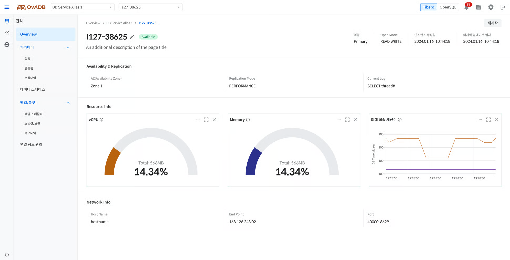

**OwlDB**You can monitor the status and resource usage of running instances and modify or restart instances as needed. When the instance status is `Available`not, some information may be missing.


**Note**

- From the dashboard, you can navigate to the instance management page through the following path. **[List View]** Click the arrow icon next to the database alias > click the instance alias **[Card View]** Click the instance alias on the database card
- In the AWS environment, only the Tibero engine is supported.


## Viewing the instance list 

1. **Management > Overview**Navigate to
2. **Instance** Click the tab.
3. Check the status and resource usage of the instance to review from the list.

### Primary(Leader) DB display items 



| Item | Description |
| --- | --- |
| Alias | Displays the instance alias (clicking navigates to the detailed information page) |
| Creation date | Instance creation date and time (`yyyy-mm-dd HH:mm:ss`) |
| AZ | The availability zone where the instance is placed |
| Health | The current status of the instance (Available / In progress / Limited / Unavailable) |
| Open Mode | The operation mode of the DB (READ WRITE) |
| Replication Mode | The operating mode of the Primary DB (PERFORMANCE) |
| CPU | Usage bar chart relative to the provisioned vCPU |
| Memory | Usage bar chart relative to the provisioned memory |
| Active sessions | Bar chart of the number of active sessions |
| Data Volume | data volume usage (including 90% threshold display) |
| Redo log Volume | redo log volume usage |
| Archive log Volume | archive log volume usage |
| Root Volume | root volume usage |
| Current Log | The most recent Redo log identifier value (displayed only when Standby is configured) |


| Item | Description |
| --- | --- |
| Alias | Displays the instance alias (clicking navigates to the detailed information page) |
| Creation date | Instance creation date and time (`yyyy-mm-dd HH:mm:ss`) |
| AZ | The availability zone where the instance is placed |
| Health | The current status of the instance (Available / In progress / Limited / Unavailable) |
| Open Mode | The operation mode of the DB (READ WRITE) |
| CPU | Usage bar chart relative to the provisioned vCPU |
| Memory | Usage bar chart relative to the provisioned memory |
| Active sessions | Bar chart of the number of active sessions |
| Volume | The total and usage of the OpenSQL volume |
| Root Volume | root volume usage |
| Current Log | The most recent WAL log identifier value (LSN, displayed only when HA is configured) |



### Standby(Replica) DB display items 



| Item | Description |
| --- | --- |
| Alias | Displays the instance alias (clicking navigates to the detailed information page) |
| Creation date | Instance creation date and time (`yyyy-mm-dd HH:mm:ss`) |
| AZ | The availability zone where the instance is placed |
| Health | The current status of the instance (Available / In progress / Limited / Unavailable / Retired) |
| Standby Status | `v$standby` Displayed when queried `status` Value display |
| Open Mode | The operation mode of the DB (MOUNTED / RECOVERY / READ WRITE / READ ONLY / READ ONLY WITH APPLY) |
| Log Replication Type | The replication method of the Standby (LGWR ASYNC / ARCH ASYNC) |
| CPU | Usage bar chart relative to the provisioned vCPU |
| Memory | Usage bar chart relative to the provisioned memory |
| Active sessions | Bar chart of the number of active sessions (displayed only in Read Only status) |
| log last received | The most recently received Redo log identifier value from the Primary (TSN value) |
| log last applied | The most recently applied Redo log identifier value on the Standby (TSN value) |
| Replication Lag (seconds) | The replication delay time with the Primary DB |


| Item | Description |
| --- | --- |
| Alias | Displays the instance alias (clicking navigates to the detailed information page) |
| Creation date | Instance creation date and time (`yyyy-mm-dd HH:mm:ss`) |
| AZ | The availability zone where the instance is placed |
| Health | The current status of the instance (Available / In progress / Limited / Unavailable) |
| Open Mode | The operation mode of the DB (READ ONLY) |
| Log Replication Type | The replication method of the Replica (ASYNC / SYNC) |
| CPU | Usage bar chart relative to the provisioned vCPU |
| Memory | Usage bar chart relative to the provisioned memory |
| Active sessions | Bar chart of the number of active sessions (always displayed) |
| log last received | The most recently received WAL log identifier value from the Leader (LSN value) |
| log last applied | The most recently applied WAL log identifier value on the Replica (LSN value) |
| Replication Lag (seconds) | The replication delay time with the Leader DB |




**Caution**

If the instance status is `Available`If it is not, a banner appears at the top of the screen to provide guidance on the current status.


## Viewing instance detailed information 

<figure>

<figcaption>Figure 1. Instance detailed information</figcaption>
</figure>

Clicking an alias in the instance list navigates to the detailed information page for that instance. The detail page is organized in the following order: top summary information, availability and replication information, resource usage status, network information, and database information.

1. On the Overview page **Instance** Click the tab.
2. Click the alias of the instance whose detailed information you want to review in the instance list.
3. On the detailed information page, check the top information, availability and replication information, resource usage information, network information, and database information.

### Top information 

| Item | Description | Primary/Leader | Standby/Replica |
| --- | --- | --- | --- |
| Health | Instance status | Available / In progress / Limited / Unavailable | Common (Tibero includes Retired) |
| Role | Instance Role | Tibero: Primary / OpenSQL: Leader | Tibero: Standby(Recovery/Read Only) / OpenSQL: Replica |
| Instance Creation Date | Creation Date/Time (`yyyy-mm-dd HH:mm:ss`) | Common | Common |
| Open Mode | DB Operation Mode | READ WRITE | Tibero: MOUNTED/RECOVERY/READ WRITE/READ ONLY/READ ONLY WITH APPLY, OpenSQL: READ ONLY |
| Last Update Date | Configuration Change Date/Time (`yyyy-mm-dd HH:mm:ss`) | Common | Common |

### Availability and Replication Information 

Primary/Leader displays the items below, while Standby/Replica displays additional replication-related items alongside the same items.



| Item | Description | Display Target |
| --- | --- | --- |
| AZ | Deployed Availability Zone | Common |
| Replication Mode | The operating mode of the Primary DB (PERFORMANCE) | Primary |
| Current Log | Most Recent Redo log Identifier (TSN) | Common |
| Standby Status | Standby Replication Status (may differ per node) | Standby |
| Log Replication Type | Replication Method (LGWR ASYNC / ARCH ASYNC) | Standby |
| log last received | Most Recent Redo log Received from Primary (TSN) | Standby |
| log last applied | Most Recent Redo log Applied to Standby (TSN) | Standby |
| Replication Lag (seconds) | Replication Lag Time with Primary | Standby |


| Item | Description | Display Target |
| --- | --- | --- |
| AZ | Deployed Availability Zone | Common |
| Current Log | Most Recent WAL log Identifier (LSN) | Common |
| Log Replication Type | Replication Method (ASYNC / SYNC) | Standby |
| log last received | Most Recent WAL log Received from Leader (LSN) | Replica |
| log last applied | Most Recent WAL log Applied to Replica (LSN) | Replica |
| Replication Lag (seconds) | Replication Lag Time with Primary | Standby |



### Resource Usage Information 

<table><thead><tr><th>Item</th><th>Description</th><th>Remarks</th></tr></thead><tbody><tr><td>CPU</td><td>Usage Relative to Provisioned vCPU (Pie Chart)</td><td>Updated Every 5 Seconds</td></tr><tr><td>Memory</td><td>Usage Relative to Provisioned Memory (Pie Chart)</td><td>Updated Every 5 Seconds</td></tr><tr><td>Maximum Number of Connected Sessions</td><td>Number of Active Sessions (Line Chart, Updated Every 5 Seconds)</td><td><ul><li>Tibero Standby: Displayed Only in Read Only State</li><li>OpenSQL Replica: Always Displayed</li></ul></td></tr></tbody></table>

### Network Information 

| Item | Description |
| --- | --- |
| Host Name | Host Name on Which the Database Server Is Running |
| End Point | Client Connection Address (Private IP) |
| Port | Database Communication Port Number |

### Database Information 


**Note**

Database information is provided only by the OpenSQL engine.


| Item | Description |
| --- | --- |
| Auto Vacuum | Whether Auto Vacuum Is Enabled (On / Off) |
| Database List | Displays the sub-databases by name, Data Size (GB), active sessions, Bloat Ratio (%), and creation date; clicking the name navigates to the detailed information. |

The active session value is displayed based on the Primary node if the instance being queried is Primary/Leader, and based on the Standby node if it is Standby/Replica.


**Caution**

- If Health is `Available`Other than this, some information may be displayed as missing.
- If Health is `Retired`In this case (occurs only on Tibero's Standby instance), all information except Health is displayed as `-`, and **Restart** instead of the **Delete** button, the

button appears.

