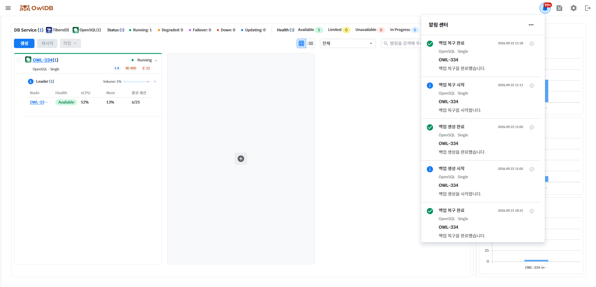

Provides notifications for various events that occur while using OwlDB. Notifications can be checked by clicking the 🔔 icon in the upper right of the console screen.

<figure>

<figcaption>Figure 1. Notifications</figcaption>
</figure>

- Click the ✔ icon to the right of a message to change its read status.
- Messages marked as read are automatically deleted after 30 days.
- Upper right **meatball menu** icon > **Mark All as Read**Clicking this marks all messages as read.
