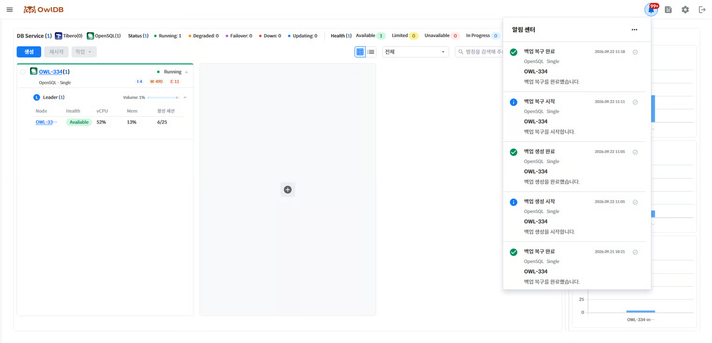

Notifications are provided for various events that occur while using OwlDB. You can check notifications by clicking the 🔔 icon in the top right of the console screen.

<figure>

<figcaption>Figure 1. Notifications</figcaption>
</figure>

- Click the ✔ icon to the right of a message to change its read status.
- Messages marked as read are automatically deleted after 30 days.
- Clicking the **meatball menu** icon in the top right > **Mark All as Read** marks all messages as read.
