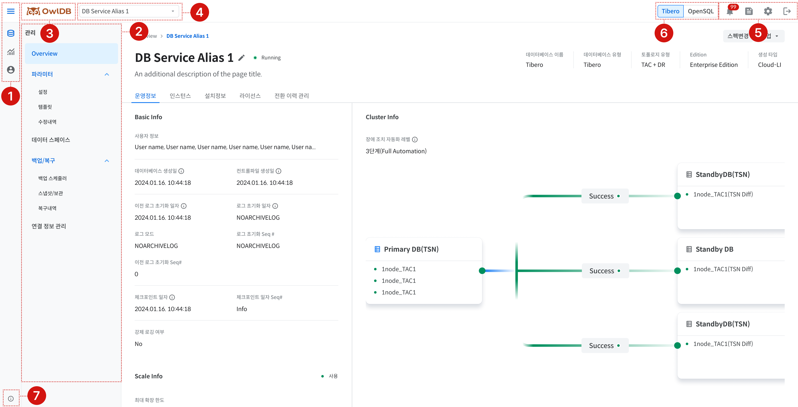
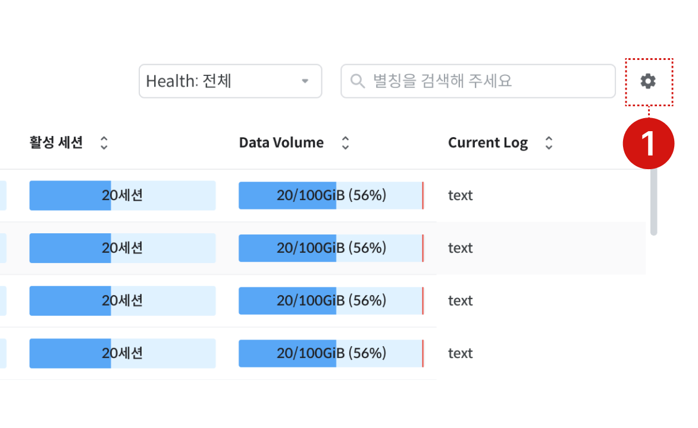

<figure>

<figcaption>Figure 1. Console Screen Components</figcaption>
</figure>

Describes the components and functions of each area of the console screen.

<table data-full-width="true"><thead><tr><th>Element</th><th>Description</th></tr></thead><tbody><tr><td>① GNB - Menu</td><td><ul><li>Hamburger menu: Function to open and close the menu panel</li><li>Menu icon: Function to open and close the detailed menu area for the main functions</li></ul></td></tr><tr><td>② Detailed Menu Area</td><td><ul><li>Displays the list of submenus for the selected menu icon</li><li>Page navigation function</li></ul></td></tr><tr><td>③ Logo</td><td><strong>Dashboard</strong> Navigates to the page</td></tr><tr><td>④ DB / Instance Selection</td><td><ul><li>Selects the database and instance to be managed and monitored</li><li>Selection items may vary by function (see '<a href="#IAtHKOuaikB0qe5kmvf4">Usage Guide by Function</a>')</li></ul></td></tr><tr><td>⑤ GNB - Others</td><td><ul><li>Notification Center</li><li>User Guide</li><li>User Settings (language, theme)</li><li>Logout</li></ul></td></tr><tr><td>⑥ DB Engine Selection</td><td><ul><li>Function to select the DB engine to display on the screen</li><li>Changes the DB Service list in the DB/Instance selection dropdown according to the selected DB engine</li></ul></td></tr><tr><td>⑦ Info</td><td>Version and release information</td></tr></tbody></table>

<figure>

<figcaption>Figure 2. Table Settings</figcaption>
</figure>

<table data-full-width="true"><thead><tr><th>Element</th><th>Description</th></tr></thead><tbody><tr><td>① Table Settings</td><td><ul><li>Function to select and deselect table fields to display on the screen</li><li>Adjust table field order</li></ul></td></tr></tbody></table>
