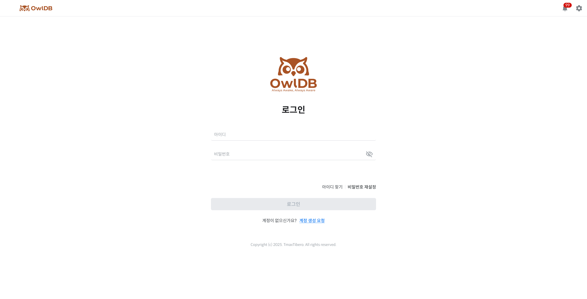

<figure>

<figcaption>Figure 1. Login</figcaption>
</figure>

## Root First Login

When the OwlDB deployment is complete, the Root account information is sent to the email address entered during stack creation.

| Item | Initial value |
| --- | --- |
| ID | admin or user input value |
| Password | Temporary password |

1. Go to the access URL provided in the email.
2. Enter the Root account and temporary password received in the email.
3. **Login** Click the button.
4. For security purposes on first login, **Change Password** You are automatically redirected to the page.
5. Enter a new password.
6. Change the password.
7. Log in again with the changed password.


**Caution**

- Be sure to change the password after the first login.
- You cannot navigate to other pages until you change the password.


---

## Login

**Login** Enter your account information on the page to access OwlDB.

1. **Login** Enter your ID and password on the page.
2. **Login** Click the button.
3. When authentication is complete, **Dashboard** You are redirected to the page.


**Note**

If you do not have a Member account, **Login** on the page **Request Account Creation** You can request account creation by clicking the button. For more details, refer to Request Account Creation.


---

## Find ID

If you have forgotten your ID, you can check your ID through your registered email address.


**Note**

The Find ID feature is only available in the Cloud environment.


1. **Login** on the page **Find ID**Click.
2. Enter your registered email address.
3. **Send Email**Click.
4. Once the entered email address is verified, an ID notification email is sent.
5. **Log In**Click **Login** to go to the page.

### Email Verification Criteria by Account

| Account | Email to enter |
| --- | --- |
| Root | The email address entered when subscribing to OwlDB |
| Member | The email address registered to the account |


**Note**

If the entered email address does not match the registered information, the ID cannot be found.


## ID Notification Email

Once email verification is complete, an ID notification email is sent to the registered email address.

The email includes the following information.

- ID
- OwlDB **Login** Page shortcut

After receiving the email, **Go to OwlDB**Click **Login** Go to the page and log in with the ID you were notified of.

### If you did not receive the email

If the ID notification email has not arrived, **Resend Email**You can send it again by clicking.


**Note**

An email can be resent up to 5 times within 10 minutes. If the resend limit is exceeded, you must try again after a certain period of time.


---

## Reset Password

If you have forgotten your password, you can verify your registered account information, receive a temporary password, and then change it to a new password.


**Note**

The password reset feature is provided only in the Cloud environment.


### Issuing a Temporary Password

1. **Login** On the page, **Reset Password**Click.
2. Enter your ID and registered email address.
3. **Send Email**Click.
4. Once the entered account information is verified, a temporary password is sent to the registered email address.
5. **Log In**Click to **Login** Move to the page.


**Note**

If the entered ID and email address do not match the registered information, you cannot receive a temporary password.


## Logging In with a Temporary Password

1. In the email, **Temporary Password**Check.
2. **Login** Enter your ID and temporary password on the page.
3. **Login**Click.
4. **Reset Password** You are automatically moved to the page.


**Caution**

If you have logged in with a temporary password, you cannot use other pages until you change your password.


## Change Password

1. Enter a new password.
2. Enter the password again to confirm it.
3. **Change Password**Click.
4. Once the password change is complete, **Login** Move to the page.
5. Log in again with your changed password.


**Note**

You cannot use a password that is identical to your existing password.

