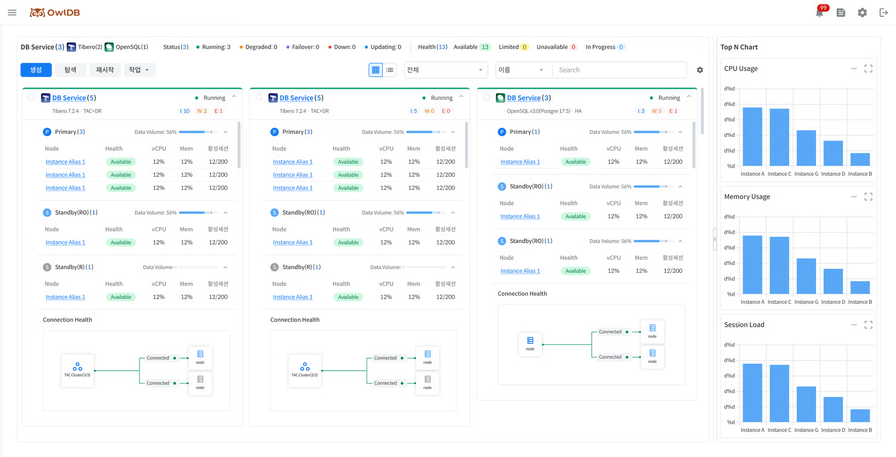

Provides summary information and notifications about the status of all databases and instances in operation. **OwlDB console screen > OwlDB logo**Click to view the dashboard.

<figure>

<figcaption>Figure 1. Dashboard</figcaption>
</figure>

# Checking the overall status summary information

For all databases/instances in operation, check the top-level status value (**Status**) and detailed status value (**Health**). Clicking each status lets you check the '[Checking the DB Service/instance list](#db-service인스턴스-목록-확인)' for the list of DB Services/instances with that status value.



Status, the top-level status, is displayed on a per-database basis.

- Because the status can change for each instance node, the count is displayed next to the status in the form (n/m). n: Number of available instance nodes m: Total number of instance nodes
- Types marked in Bold with a `*`appended can be filtered on the dashboard.

| Type | Description |
| --- | --- |
| Provisioning | Creating a new resource |
| **Running** * | Database is available for normal use |
| **Updating** * | Applying planned tasks or changes to the database (e.g., full restart, role switchover, spec change, migration, recovery, etc.) |
| **Degraded** * | Some databases or components are unavailable (e.g., individual instance restart, etc.) |
| **Failover** * | The system has detected a database failure and is performing Auto Failover (occurs when the entire Primary DB cluster becomes Unavailable) |
| **Down** * | The entire database is unavailable (both Primary and Standby are unavailable) |
| Starting | Transitioning from Stopped state to Running |
| Stopping | Transitioning from Running state to Stopped (transition to VM stop after transaction rollback and process termination) |
| Stopped | All resources are temporarily unused (resources deactivated) |
| Terminating | Permanently deleting all resources and data (once complete, access and recovery are not possible) |

*표기는 필수 입력 항목을 의미합니다.

The * mark indicates a required input item.


Health, the detailed status, is displayed on a per-instance-node basis.

- It is displayed by combining DB Boot Mode, Instance, cluster management tool (hereinafter CMT), and Agent connection status.
- Functions restricted according to the message can be checked via a banner when entering each menu.

The Health determination criteria per engine are as follows.

- Tibero: Determined by combining DB Boot Mode, cluster management tool (CMT), and Agent status.
- OpenSQL: Determined by combining Patroni, OpenProxy, etcd, and Agent status.



| Display | Status | Message | Description |
| --- | --- | --- | --- |
| 🟢 Available | available | - | Node normal |
| 🟡 Limited | limited | Issue: CMT Inactive | Cluster management tool (CMT) abnormal |
|   | limited | Issue: Mount Mode | Node started in Mount mode |
| 🔴 Unavailable | unavailable | Issue: Nomount Mode | Node started in Nomount mode |
|   | unavailable | Issue: DB Down | Node DB Down |
|   | unavailable | Issue: Agent Disconnect | Agent connection lost with the VM where the node is located |
|   | unavailable | Issue: VM Down | VM Down where the node is located |
| ⚫ Retired | retired | Issue: Failovered Primary | (Former) Primary abnormally terminated during Failover |


The Health of an OpenSQL instance node is determined by combining the states of Patroni, OpenProxy, etcd, and Agent.

| Display | Status | Message | Description |
| --- | --- | --- | --- |
| 🟢 Available | available | - | Node normal |
| 🟡 Limited | limited | Issue: etcd Inactive | etcd abnormal |
|   | limited | Issue: OpenProxy Inactive | OpenProxy abnormal |
| 🔴 Unavailable | unavailable | Issue: DB Down | DB Down due to Patroni abnormality |
|   | unavailable | Issue: Agent Disconnect | Agent connection lost with the node's host VM |



`🔵 In Progress` The status applies commonly to both Tibero and OpenSQL.

| Level | Message |
| --- | --- |
| Individual instance node | Reboot, Switchover, Failover, Rebuilding, Modify Spec (TAC Scale In/Out) |
| All instances | Modify Spec (Scale Up/Down), Migration, Restoring, Patch/Upgrade, Starting, Stopping |


**Note**

A cluster management tool is a component required to operate databases in a cluster configuration. (e.g., Tibero Cluster Manager(CM), Tibero Active Storage(TAS), etc.)




# Checking the DB Service/Instance List

Check the list of all DB Services and their sub-instances. '[Checking the Overall Status Summary Information](#전체-상태-요약-정보-확인)The DB Services and instance list displayed varies depending on the status value selected in '.

- You can perform a restart operation on the sub-instances of the selected database.
- You can perform start, stop, delete, role switch, and license renewal management operations on the selected database.
- Provides a database/instance alias search function.


**Note**

You can perform various management operations on a DB Service. For more details, **Operations** You can check it on the page.


### Switching the List View (Card View/List View)

You can view the DB Service/Instance list in two ways: Card View and List View. When switching views, the sorting function is reset, but filtering is retained.



Card View organizes and displays the key information of a DB Service in the form of individual cards so that it is easy to grasp visually. A maximum of 4 cards are displayed per row, and the size of each card is fixed. If the content exceeds the fixed size, internal scrolling is enabled. The last cell of the currently operating DB Service card list displays an `➕` icon, and clicking it navigates to the DB Service creation page.

<table data-full-width="true"><thead><tr><th>Item</th><th>Description</th></tr></thead><tbody><tr><td>DB Service Information</td><td>Displays a summary of the key information of the database at the top of the card Display Items<ul><li>DB Type Logo</li><li>DB Service Name</li><li>Status</li><li>DB Type</li><li>DB version (in the case of OpenSQL, the OpenSQL version and PostgreSQL version are displayed simultaneously)</li><li>Topology</li><li>Eventlog : I / W / E (Info / Warning / Error respectively)</li></ul></td></tr><tr><td>Node Information</td><td>Displays the instance information linked under the database. Can be collapsed/expanded in an accordion form based on Role Sorting Rules<ul><li>Tibero: Displayed in the order of Primary → Standby(Read Only) → Standby(Recovery)</li><li>OpenSQL: Displayed in the order of Leader → Replica</li><li>Sorted by AZ within the same Role</li></ul>Display Items<ul><li>Role : Displays the number of instances for that role</li><li>Data volume (Tibero) / Volume (OpenSQL): Displays usage(%), bar chart, and Threshold</li></ul>Table Items<ul><li>Instance Alias</li><li>Health</li><li>vCPU: Current CPU usage(%)</li><li>Memory: Current memory usage(%)</li><li>Active Sessions: Current number of active sessions / Max Session Count (not displayed for Standby(Recovery))</li><li>Availability Zone: AZ information where the instance is located</li></ul></td></tr><tr><td>Cluster Information</td><td>Display Connection Health as a cluster diagram<ul><li>Single: Displays only Primary/Leader DB information</li><li>Single +DR / HA: Displays Primary/Leader DB and Standby/Replica DB information. Displays P-S connection status monitoring information; Standby/Replica DBs are each created per AZ</li><li>Tibero TAC: Displays multiple nodes inside the Primary DB Box</li><li>Tibero TAC + DR: Displays Primary DB and Standby DB information. Displays P-S connection status monitoring information; multiple nodes are displayed inside the Primary DB Box; Standby DBs are each created per AZ</li><li>DR configuration connection status monitoring: Represents the connection status between Primary - Standby / Leader - Replica through line color and displayed information</li><li>Normal: green,<code>Connected</code></li><li>Failed: red,<code>Disconnected</code></li></ul></td></tr></tbody></table>


The list view displays database and sub-instance information in a tree-shaped table to make it easy to understand the hierarchical structure.


**Note**

'Default value' refers to items that are exposed by default on the initial screen, and 'Required value' refers to items that cannot be hidden.


<table data-full-width="true"><thead><tr><th>Column</th><th>Description</th><th>DB Service level</th><th>Instance level</th><th>Default value</th><th>Required value</th></tr></thead><tbody><tr><td><strong>Name</strong></td><td>Display Name<ul><li>Clicking the DB Service name navigates to the '<a href="https://github.com/hhjinn/gitbookPAT/tree/dori/TgpIeVAAe6TUtfrjaD2G/doc/5d7daeb2-e4f4-4409-aa74-dcaf1d65ab46/README.md">Service Meta Information Query</a>' page</li><li>Clicking the instance alias navigates to the '<a href="https://github.com/hhjinn/gitbookPAT/tree/dori/TgpIeVAAe6TUtfrjaD2G/doc/dF57s45IXBUgU7RX1UvL/README.md">Instance Management</a>' page</li></ul></td><td>DB Service name</td><td>Instance alias</td><td>O</td><td>O</td></tr><tr><td><strong>Creation Date</strong></td><td>Displays the DB Service creation date in <code>yyyy.mm.dd HH:mm:ss</code> format</td><td>DB Service creation date</td><td>X</td><td>X</td><td>X</td></tr><tr><td><strong>Status</strong></td><td>Displays Status or Health</td><td><ul><li>Creating</li><li>Running(n/m)</li><li>Updating(n/m)</li><li>Degraded(n/m)</li><li>Failover(n/m)</li><li>Down(n/m)</li><li>Starting</li><li>Stopping</li><li>Stopped</li><li>Terminating</li><li>Deploying (on-premise)</li><li>Registering (on-premise)</li><li>Unregistering (on-premise)</li></ul></td><td><ul><li>🟢 (available)</li><li>🟡 (limited)</li><li>🔵 (in progress)</li><li>🔴 (unavailable)</li></ul></td><td>O</td><td>O</td></tr><tr><td><strong>Type</strong></td><td>Displays the database engine type</td><td><ul><li>Tibero</li><li>OpenSQL</li></ul></td><td>-</td><td>O</td><td>X</td></tr><tr><td><strong>Configuration</strong></td><td>Displays the topology or role</td><td><ul><li>Tibero: Single, TAC(+DR)</li><li>OpenSQL: Single, HA</li></ul></td><td><ul><li>Tibero: Primary, Standby(Read Only), Standby(Recovery)</li><li>OpenSQL: Leader, Replica</li></ul></td><td>O</td><td>O</td></tr><tr><td><strong>Availability Zone (Cloud)</strong></td><td>In a Cloud environment, displays the Availability Zone (AZ) information where the corresponding instance is located</td><td>-</td><td>Availability Zone (AZ) information</td><td>O</td><td>X</td></tr><tr><td><strong>vCPU</strong></td><td>Displays the CPU count and usage as a bar chart</td><td>O</td><td>O</td><td>O</td><td>X</td></tr><tr><td><strong>Memory</strong></td><td>Displays Memory and usage as a bar chart</td><td>O</td><td>O</td><td>O</td><td>X</td></tr><tr><td><strong>Active Sessions</strong></td><td>Displays the number of currently active sessions as a bar chart<ul><li>Displayed only for Primary / Standby(RO) / Leader / Replica</li><li>Standby(Recovery) :<code>-</code>Displayed as</li></ul></td><td>O</td><td>O</td><td>O</td><td>X</td></tr><tr><td><strong>Data Volume (Tibero)</strong></td><td>Displays data volume usage as a bar chart + shows Threshold</td><td>O</td><td>X</td><td>O</td><td>X</td></tr><tr><td><strong>Redo log Volume (Tibero)</strong></td><td>Displays redo log volume usage as a bar chart</td><td>O</td><td>X</td><td>X</td><td>X</td></tr><tr><td><strong>Archive log Volume (Tibero)</strong></td><td>Displays archive log volume usage as a bar chart</td><td>O</td><td>X</td><td>X</td><td>X</td></tr><tr><td><strong>Root Volume</strong></td><td>Displays Root volume usage as a bar chart</td><td>O</td><td>O</td><td>X</td><td>X</td></tr></tbody></table>



### DB Service List User Settings

The ⚙️ in the upper-right corner of the DB Service List screen **Settings** Clicking the icon lets you configure the screen display method to suit your environment.

- Card View : Configures the information area displayed on the card.
- List View : Configures the columns displayed in the list.

The configured settings are saved per user and are applied consistently thereafter.



In Card View, you can select the information area to display on the card.

1. On the DB Service List screen, click ⚙️ **Settings**Click.
2. **Configuration**Turn the items to display ON/OFF.
3. Right side **Preview**Check the changes in advance in the preview.
4. **Save**Click to apply.

### Setting Items

| Item | Description |
| --- | --- |
| DB Service Info | Displays basic DB Service information |
| Node Info | Displays status and resource information per node |
| Cluster Info | Displays Cluster information and Connection Health |


**Note**

You can check the results of changes in real time in the Preview area on the right. They are not applied to the actual screen until saved.



In List View, you can select the columns to display in the list or change the column order.

1. On the DB Service List screen, click ⚙️ **Settings**Click.
2. Toggle the columns to display ON/OFF.
3. Change the column order via Drag & Drop.
4. **Save**Click to apply.

### Key Features

| Feature | Description |
| --- | --- |
| Show/Hide Columns | Set column visibility using the switch |
| Column Search | Quickly find the desired item by searching for the column name |
| Change Column Order | Drag to change to the desired order |
| Reset to Default | Restore to the default column configuration |



# Top N Chart Query

On the dashboard screen, view the top instances by CPU Usage, Memory Usage, and Session Load as charts for DB Services that you have query permission for. The Top N chart is displayed in the right area of the dashboard, and data is automatically configured according to the query permission scope of the logged-in user without any separate settings. If there is no DB Service with query permission, a no-data state is displayed in the chart area.


**Note**

**Differences in Supported Engines by Environment**

- AWS environment: Only Tibero engine instances are included in the query scope.
- Azure environment: Both Tibero and OpenSQL engine instances are included in the query scope.


### Displayed Metrics

<table data-full-width="true"><thead><tr><th>Metric</th><th>Description</th></tr></thead><tbody><tr><td>CPU Usage</td><td>Chart of the top 5 instances by CPU usage<ul><li>Targets all instances regardless of engine type</li><li>X-axis: instance Alias</li><li>Displays data labels (%)</li></ul></td></tr><tr><td>Memory Usage</td><td>Chart of the top 5 instances by Memory usage<ul><li>Targets all instances regardless of engine type</li><li>X-axis: instance Alias</li><li>Displays data labels (%)</li></ul></td></tr><tr><td>Session Load</td><td>Chart of the top 5 instances by Session Load (%)<ul><li>A metric representing the ratio of Active Session to Max Session</li><li>X-axis: instance Alias</li><li>Displays data labels (%)</li><li>Tooltip: (Active Session/Max Session)X100</li></ul></td></tr></tbody></table>

### Expand/Collapse Chart Area

Clicking the button at the top of the Top N chart area collapses or expands the chart area.

- The default state is expanded.
- If the user changes it to the collapsed state, the collapsed state is maintained even when navigating to another screen and returning within the same session.
- When you log out or the session ends and you connect with a new session, it is reset to the expanded state.
