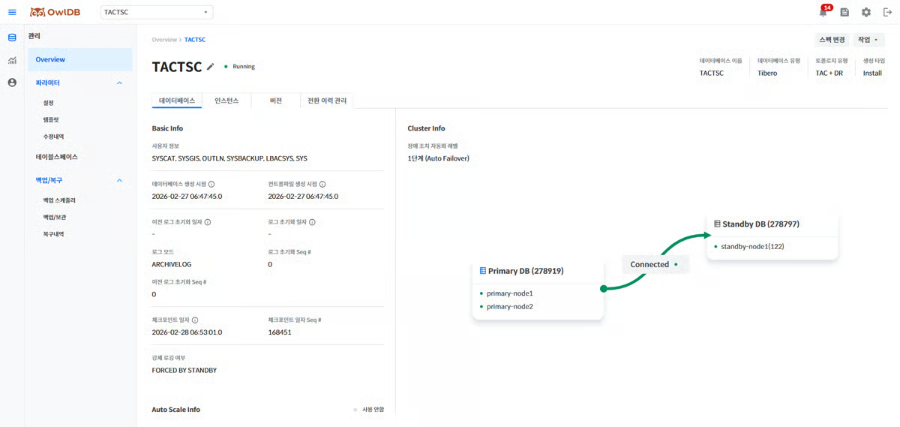
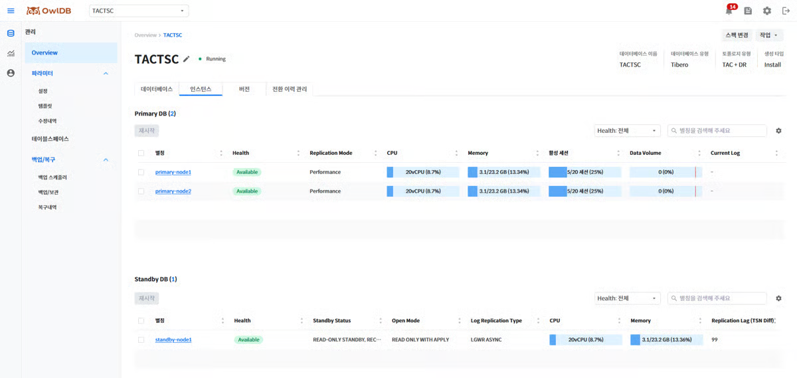

Queries the status of databases operating in OwlDB and performs operations such as modification, stopping, starting, deletion, role switchover, license renewal, and spec changes.


**Note**

- When the instance status is `Running`other than this, some information may be missing.
- The database management page displays times based on the database timezone, so there may be a difference from the local system time (browser time).


---

## Querying Database Information

1. **Management > Overview** Click the menu.
2. **DB Service Alias** Click the dropdown button to select the database whose information you want to query.
3. Check the detailed information in the Operation Information, Instance, Installation Information, (DR/HA) Switchover History Management, and (BYOL) License tabs.


**Note**

The database operation status can be found on the **Overall Status Summary Information** page.



**Note**

If you are using the BYOL license model and the license expiration date is within 3 months, an expiration notice banner is displayed at the top of the screen. In the banner's **Go to Renewal Page** Click the link to move to the license renewal screen.




<figure>

<figcaption>Figure 1. Operation Information</figcaption>
</figure>

You can check detailed database information such as account information that can access the database, control files, logs, and checkpoints, and you can visually check the database configuration as a diagram.


**Note**

All items that display date and time are shown based on the database timezone.



<figure>

<figcaption>Figure 2. Instance</figcaption>
</figure>

Check the list and information of configured instances.

- **Instance Alias**When you click, "[Instance Management](#dF57s45IXBUgU7RX1UvL)" page is displayed.
- After first selecting one or more instances with the ☑️ icon **Restart** Click the button, or without selecting **Restart** Click the button directly, and in the modal that opens you can select the instances to restart and the restart options. For details, refer to "[Restarting an Instance](#undefined-2)".


**Note**

When using a DR configuration, the Primary(Leader) DB and Standby(Replica) DB are queried separately.



Check the database version information, system and compile information, and patch (or Extension) information.

The system and compile information displays binary OS information and the like as a list, regardless of the engine. Basic Info and patch information vary depending on the engine as follows.

<table data-full-width="true"><thead><tr><th>Item</th><th>Tibero</th><th>OpenSQL</th></tr></thead><tbody><tr><td>Basic Info</td><td><ul><li>Major version</li><li>Minor version</li><li>Patchset version</li></ul></td><td><ul><li>OpenSQL version (e.g., 3.0)</li><li>PostgreSQL version (e.g., 17.5)</li></ul></td></tr><tr><td>System and Compile Information</td><td>Displays binary OS information and the like as a list</td><td>Displays binary OS information and the like as a list</td></tr><tr><td>Patch Information / Extensions</td><td><ul><li>Displays the list of applied patches</li><li>If none, displays the message "There are no applied patches"</li></ul></td><td><ul><li>Displays the list of currently installed Extensions</li><li>Extensions added via DDL during operation are also reflected as of the query time</li></ul></td></tr></tbody></table>


**Note**

Items whose values cannot be queried are displayed as `-`displayed as.



This tab is provided in the BYOL license model.

- Check the license in use and the assigned instance information.
- You can also check information on expired licenses.


**Note**

If an idle license exists, **Rebuild** Through the button, you can create instances and assign licenses according to the existing license configuration.



This tab is provided for Tibero DR configurations or OpenSQL HA configurations.

Check the history of database role switchover events that have occurred. When a switchover event completes, an entry is added to the history.

<table data-full-width="true"><thead><tr><th>Column Name</th><th>Description</th><th>Data Format</th><th>Default Value</th><th>Required Value</th></tr></thead><tbody><tr><td>ID</td><td><ul><li>A number that uniquely identifies a switchover event</li><li>Format: {event type-random string 16 bytes}</li><li>Event type: FO / SO / FB</li></ul></td><td><ul><li>FO-3f9a7c1e2d8b45f0</li><li>SO-b17e4a93d2c68f5e</li><li>FB-7a2d9e14c6b83f05</li></ul></td><td>O</td><td>X</td></tr><tr><td>Start Time</td><td>Time when the transition event occurred</td><td>yyyy.mm.dd HH:mm:ss</td><td>O</td><td>O</td></tr><tr><td>Completion Time</td><td>Time when the transition event completed</td><td>yyyy.mm.dd HH:mm:ss</td><td>X</td><td>X</td></tr><tr><td>Type</td><td>Transition event type</td><td><ul><li>Failover</li><li>Switchover</li><li>Failback</li></ul></td><td>O</td><td>O</td></tr><tr><td>Executed By</td><td>The entity that executed the event</td><td><ul><li>Switchover: {user ID}</li><li>Failover: {user ID} / system(Auto Failover)</li><li>Failback: {user ID}</li></ul></td><td>O</td><td>X</td></tr><tr><td>Result</td><td>Displays the status of the event</td><td><ul><li>Success</li><li>Failure</li></ul></td><td>O</td><td>X</td></tr><tr><td>Cause/Remarks</td><td>Displays the cause of the event, the value entered by the user, or the failure reason</td><td><ul><li>Value optionally entered by the user during role transition (up to 200 characters, blank if not entered)</li><li>Trigger condition for Auto Failover</li><li>On Failback failure: Standby/Replica Reboot Failed or Switchover Failed</li><li>On Failover failure: Standby/Replica Promotion Failed</li><li>On post-processing failure after successful Failover: Cluster Normalization Failed(Primary scale out failed / New Standby/Replica creation failed, displayed separated by commas in case of multiple failures)</li></ul></td><td>O</td><td>X</td></tr></tbody></table>



---

## Editing DB Service Information

1. Next to the DB Service alias **pencil icon**Click.
2. Edit the DB Service alias and description.
3. **Save** Click the button.
