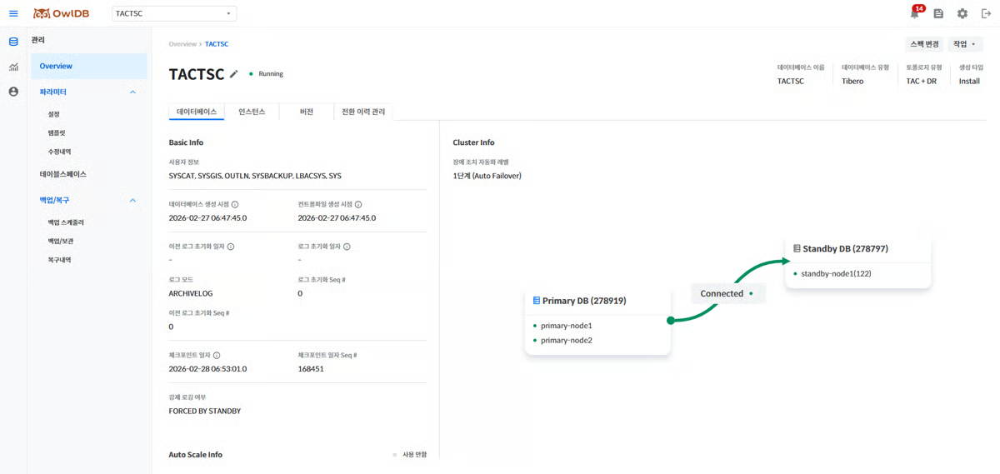
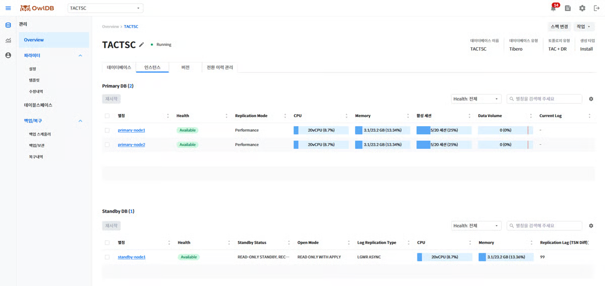

Queries the status of databases running in OwlDB and performs operations such as modify, stop, start, delete, role switchover, license renewal, and spec change.


**Note**

- When the instance status is `Running`if not, some information may be missing.
- The database management page displays time based on the database timezone, so it may differ from the local system time (browser time).


---

## Querying Database Information

1. **Management > Overview** Click the menu.
2. **DB Service Name** Click the dropdown button and select the database whose information you want to query.
3. Check detailed information in the Operation Info, Instance, Version, and (DR/HA) Switchover History Management tabs.


**Note**

For the database operation status, **Overall Status Summary Information** please refer to the page.




<figure>

<figcaption>Figure 1. Operation Info</figcaption>
</figure>

You can check detailed database information such as account information that can access the database, control files, logs, and checkpoints, and visually check the database configuration as a diagram.


**Note**

All items that display a date and time are shown based on the database timezone.



<figure>

<figcaption>Figure 2. Instance</figcaption>
</figure>

Check the configured instance list and information.

- **Instance Alias**Clicking it opens the "[Instance Management](#dF57s45IXBUgU7RX1UvL)" page.
- After first selecting one or more instances with the ☑️ icon, **Restart** click the button, or without selecting any, **Restart** click the button directly to open a modal where you can select the instances to restart and the restart options. For details, refer to "[Restart Instance](#undefined-2)".


**Note**

When using a DR configuration, queries distinguish between the Primary (Leader) DB and the Standby (Replica) DB.



Check the database version information, system and compile information, and patch (or Extension) information.

System and compile information displays binary OS information and so on as a list, regardless of the engine. Basic Info and patch information vary by engine as follows.

<table data-full-width="true"><thead><tr><th>Item</th><th>Tibero</th><th>OpenSQL</th></tr></thead><tbody><tr><td>Basic Info</td><td><ul><li>Major version</li><li>Minor version</li><li>Patchset version</li></ul></td><td><ul><li>OpenSQL version (e.g., 3.0)</li><li>PostgreSQL version (e.g., 17.5)</li></ul></td></tr><tr><td>System and compile information</td><td>List display of binary OS information, etc.</td><td>List display of binary OS information, etc.</td></tr><tr><td>Patch Info / Extensions</td><td><ul><li>List display of applied patch status</li><li>If none, displays the message "There are no applied patches"</li></ul></td><td><ul><li>List display of the currently installed Extension list</li><li>Extensions added via DDL during operation are also reflected as of the query time</li></ul></td></tr></tbody></table>


**Note**

Items whose value cannot be queried are displayed as `-`displayed as.



This tab is provided for a Tibero DR configuration or an OpenSQL HA configuration.

Check the history of database role switchover events that have occurred.


**Note**

OpenSQL role switchover is performed by Patroni, and OwlDB reflects it in the history by detecting that the node role has changed. At this time, since it does not distinguish whether the switchover is a Switchover performed by the user or a Failover performed by Patroni, the type is all `Failover`recorded as.


<table data-full-width="true"><thead><tr><th>Column Name</th><th>Description</th><th>Data Format</th><th>Default Value</th><th>Required Value</th></tr></thead><tbody><tr><td>ID</td><td><ul><li>A number that uniquely identifies the switchover event</li><li>Format: {event type-random string 16 bytes}</li><li>Event type: FO / SO / FB</li></ul></td><td><ul><li>FO-3f9a7c1e2d8b45f0</li><li>SO-b17e4a93d2c68f5e</li><li>FB-7a2d9e14c6b83f05</li></ul></td><td>O</td><td>X</td></tr><tr><td>Start Time</td><td>The time when the switchover event occurred</td><td>yyyy.mm.dd HH:mm:ss</td><td>O</td><td>O</td></tr><tr><td>Completion Time</td><td>The time when the transition event was completed</td><td>yyyy.mm.dd HH:mm:ss</td><td>X</td><td>X</td></tr><tr><td>Type</td><td>Transition event type</td><td><ul><li>Failover</li><li>Switchover</li><li>Failback</li></ul></td><td>O</td><td>O</td></tr><tr><td>Execution Target</td><td>The target that executed the corresponding event</td><td><ul><li>Switchover: {user ID}</li><li>Failover: {user ID} / system(Auto Failover)</li><li>Failback: {user ID}</li></ul></td><td>O</td><td>X</td></tr><tr><td>Result</td><td>Displays the status of the corresponding event</td><td><ul><li>Success</li><li>Failure</li></ul></td><td>O</td><td>X</td></tr><tr><td>Cause/Remarks</td><td>Displays the cause of the corresponding event, the value entered by the user, or the reason for failure</td><td><ul><li>A value optionally entered by the user during role transition (up to 200 characters, blank if not entered)</li><li>Trigger condition for Auto Failover</li><li>On Failback failure: Standby/Replica Reboot Failed or Switchover Failed</li><li>On Failover failure: Standby/Replica Promotion Failed</li><li>On post-processing failure after Failover success: Cluster Normalization Failed(Primary scale out failed / New Standby/Replica creation failed, displayed with commas in case of multiple failures)</li></ul></td><td>O</td><td>X</td></tr></tbody></table>



---

## Edit DB Service Information

1. Next to the DB Service alias **pencil icon**Click the
2. Edit the DB Service alias and description.
3. **Save** Click the button.
