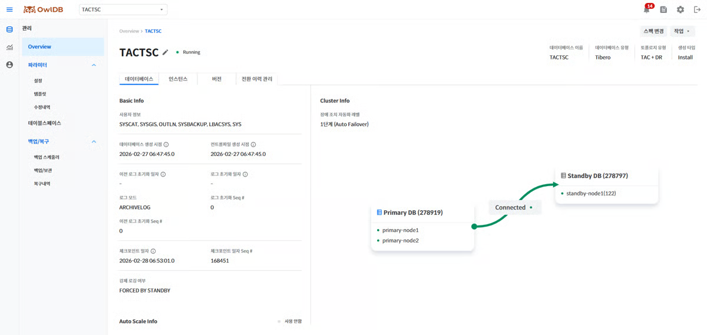
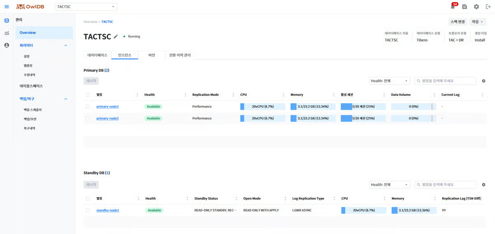

# DB Service

Query the status of databases running in OwlDB, and perform modification, stop, start, deletion, role switching, license renewal, specification changes, and more.


**Note**

* If the instance status is not `Running`some information may be missing.
* Since the database management page displays time based on the database timezone, there may be a difference from the local system time (browser time).


***

### Querying Database Information

1. **Management > Overview** Click the menu.
2. **DB Service Name** Click the dropdown button to select the database for which to query information.
3. Check the detailed information in the Operation Information, Instance, Version, and (DR/HA) Switch History Management tabs.


**Note**

For the database operation status, **Overall Status Summary Information** please refer to the page.




<figure><figcaption>
Figure 1. Operation Information
</figcaption></figure>

You can check detailed database information such as account information that can access the database, control files, logs, and checkpoints, and you can visually check the database configuration as a diagram.


**Note**

All items that display a date and time are displayed based on the database timezone.




<figure><figcaption>
Figure 2. Instance
</figcaption></figure>

Check the list and information of configured instances.

* **Instance alias**Clicking it takes you to the "[Instance management](db.md#dF57s45IXBUgU7RX1UvL)" page.
* After first selecting one or more instances with the ☑️ icon, **Restart** click the button, or without selecting, **Restart** click the button directly to open a modal where you can select the instances to restart and the restart options. For details, please refer to "[Restarting an Instance](db.md#undefined-2)".


**Note**

When using a DR configuration, query by distinguishing between the Primary (Leader) DB and the Standby (Replica) DB.




Check the database version information, system and compile information, and patch (or Extension) information.

System and compile information displays binary OS information and the like as a list, regardless of the engine. Basic Info and patch information vary depending on the engine as follows.

| Item                           | Tibero                                                                                                                                           | OpenSQL                                                                                                                                                          |
| ------------------------------ | ------------------------------------------------------------------------------------------------------------------------------------------------ | ---------------------------------------------------------------------------------------------------------------------------------------------------------------- |
| Basic Info                     | <ul><li>Major version</li><li>Minor version</li><li>Patch set version</li></ul>                                                                  | <ul><li>OpenSQL version (e.g., 3.0)</li><li>PostgreSQL version (e.g., 17.5)</li></ul>                                                                            |
| System and Compile Information | Displays a list of binary OS information and the like                                                                                            | Displays a list of binary OS information and the like                                                                                                            |
| Patch Information / Extensions | <ul><li>Displays a list of the applied patch status</li><li>If there are none, the message "There are no applied patches" is displayed</li></ul> | <ul><li>Displays a list of currently installed Extensions</li><li>Extensions added via DDL during operation are also reflected based on the query time</li></ul> |


**Note**

Items whose values cannot be queried are `-`.




This tab is provided when using a Tibero DR configuration or an OpenSQL HA configuration.

Check the history of database role switching events that have occurred.


**Note**

Role switching in OpenSQL is performed by Patroni, and OwlDB checks that the node role has changed and reflects it in the history. At this time, since it does not distinguish whether the switch is a Switchover performed by the user or a Failover performed by Patroni, the type is all `Failover`recorded as.


| Column name      | Description                                                                                                                                             | Data format                                                                                                                                                                                                                                                                                                                                                                                                                                                                                                                            | Default value | Required value |
| ---------------- | ------------------------------------------------------------------------------------------------------------------------------------------------------- | -------------------------------------------------------------------------------------------------------------------------------------------------------------------------------------------------------------------------------------------------------------------------------------------------------------------------------------------------------------------------------------------------------------------------------------------------------------------------------------------------------------------------------------- | ------------- | -------------- |
| ID               | <ul><li>A number that uniquely identifies a switch event</li><li>Format: {event type-random string 16 bytes}</li><li>Event type: FO / SO / FB</li></ul> | <ul><li>FO-3f9a7c1e2d8b45f0</li><li>SO-b17e4a93d2c68f5e</li><li>FB-7a2d9e14c6b83f05</li></ul>                                                                                                                                                                                                                                                                                                                                                                                                                                          | O             | X              |
| Start Time       | The time when the switch event occurred                                                                                                                 | yyyy.mm.dd HH\\:mm:ss                                                                                                                                                                                                                                                                                                                                                                                                                                                                                                                  | O             | O              |
| Completion Time  | The time when the switch event was completed                                                                                                            | yyyy.mm.dd HH\\:mm:ss                                                                                                                                                                                                                                                                                                                                                                                                                                                                                                                  | X             | X              |
| Type             | Switchover event type                                                                                                                                   | <ul><li>Failover</li><li>Switchover</li><li>Failback</li></ul>                                                                                                                                                                                                                                                                                                                                                                                                                                                                         | O             | O              |
| Execution target | The target that executed the event                                                                                                                      | <ul><li>Switchover: {user ID}</li><li>Failover: {user ID} / system (Auto Failover)</li><li>Failback: {user ID}</li></ul>                                                                                                                                                                                                                                                                                                                                                                                                               | O             | X              |
| Result           | Displays the status of the event                                                                                                                        | <ul><li>Success</li><li>Failure</li></ul>                                                                                                                                                                                                                                                                                                                                                                                                                                                                                              | O             | X              |
| Cause/Remarks    | Displays the cause of the event, the value entered by the user, or the reason for failure                                                               | <ul><li>Value optionally entered by the user during role transition (up to 200 characters, blank if not entered)</li><li>Trigger condition for Auto Failover</li><li>On Failback failure: Standby/Replica Reboot Failed or Switchover Failed</li><li>On Failover failure: Standby/Replica Promotion Failed</li><li>On post-processing failure after a successful Failover: Cluster Normalization Failed (Primary scale out failed / New Standby/Replica creation failed, displayed with commas in case of multiple failures)</li></ul> | O             | X              |



***

### Edit DB Service information

1. Next to the DB Service alias **Pencil icon**Click it.
2. Edits the DB Service alias and description.
3. **Save** Click the button.
