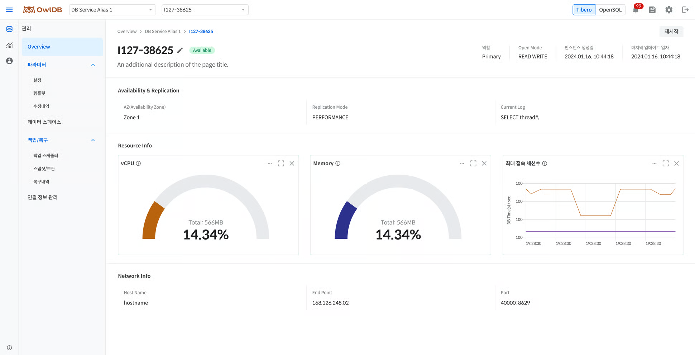

**OwlDB**You can monitor the status and resource usage of running instances and, if necessary, modify or restart instances. When the instance status is `Available`some information may be missing.


**Note**

- From the dashboard, you can navigate to the instance management page through the following paths. **[List View]** Click the arrow icon next to the database alias > click the instance alias **[Card View]** Click the instance alias on the database card
- In the AWS environment, only the Tibero engine is supported.


## Viewing the Instance List

1. **Management > Overview**.
2. **Instances** Click the tab.
3. Check the status and resource usage of the instance you want to review in the list.

### Primary(Leader) DB Displayed Items



| Item | Description |
| --- | --- |
| Alias | Displays the instance alias (click to navigate to the detailed information page) |
| Created Date | Instance creation date and time (`yyyy-mm-dd HH:mm:ss`) |
| AZ | Availability zone where the instance is located |
| Health | Current status of the instance (Available / In progress / Limited / Unavailable) |
| Open Mode | Operation mode of the DB (READ WRITE) |
| Replication Mode | Operation mode of the Primary DB (PERFORMANCE) |
| CPU | Bar chart of usage relative to provisioned vCPU |
| Memory | Bar chart of usage relative to provisioned memory |
| Active Sessions | Bar chart of the number of active sessions |
| Data Volume | data volume usage (including 90% threshold indicator) |
| Redo log Volume | redo log volume usage |
| Archive log Volume | archive log volume usage |
| Root Volume | root volume usage |
| Current Log | Most recent Redo log identifier (displayed only when Standby is configured) |


| Item | Description |
| --- | --- |
| Alias | Displays the instance alias (click to navigate to the detailed information page) |
| Created Date | Instance creation date and time (`yyyy-mm-dd HH:mm:ss`) |
| AZ | Availability zone where the instance is located |
| Health | Current status of the instance (Available / In progress / Limited / Unavailable) |
| Open Mode | Operation mode of the DB (READ WRITE) |
| CPU | Bar chart of usage relative to provisioned vCPU |
| Memory | Bar chart of usage relative to provisioned memory |
| Active Sessions | Bar chart of the number of active sessions |
| Volume | Total and usage of OpenSQL volumes |
| Root Volume | root volume usage |
| Current Log | Most recent WAL log identifier (LSN, displayed only when HA is configured) |



### Standby(Replica) DB Displayed Items



| Item | Description |
| --- | --- |
| Alias | Displays the instance alias (click to navigate to the detailed information page) |
| Creation Date | Instance creation date and time (`yyyy-mm-dd HH:mm:ss`) |
| AZ | Availability zone where the instance is located |
| Health | Current status of the instance (Available / In progress / Limited / Unavailable / Retired) |
| Standby Status | `v$standby` Displayed when queried, showing the `status` value |
| Open Mode | Operating mode of the DB (MOUNTED / RECOVERY / READ WRITE / READ ONLY / READ ONLY WITH APPLY) |
| Log Replication Type | Standby replication method (LGWR ASYNC / ARCH ASYNC) |
| CPU | Bar chart of usage against provisioned vCPU |
| Memory | Bar chart of usage against provisioned memory |
| Active Sessions | Bar chart of the number of active sessions (displayed only in Read Only state) |
| log last received | Identifier value of the most recently received Redo log from the Primary (TSN value) |
| log last applied | Identifier value of the most recently applied Redo log on the Standby (TSN value) |
| Replication Lag (seconds) | Replication delay time with the Primary DB |


| Item | Description |
| --- | --- |
| Alias | Displays the instance alias (clicking navigates to the detailed information page) |
| Creation Date | Instance creation date and time (`yyyy-mm-dd HH:mm:ss`) |
| AZ | Availability zone where the instance is located |
| Health | Current status of the instance (Available / In progress / Limited / Unavailable) |
| Open Mode | Operating mode of the DB (READ ONLY) |
| Log Replication Type | Replica replication method (ASYNC / SYNC) |
| CPU | Bar chart of usage against provisioned vCPU |
| Memory | Bar chart of usage against provisioned memory |
| Active Sessions | Bar chart of the number of active sessions (always displayed) |
| log last received | Identifier value of the most recently received WAL log from the Leader (LSN value) |
| log last applied | Identifier value of the most recently applied WAL log on the Replica (LSN value) |
| Replication Lag (seconds) | Replication delay time with the Leader DB |




**Note**

When the instance status is `Available`other than this, a banner appears at the top of the screen to provide guidance on the current status.


## Viewing Instance Details

<figure>

<figcaption>Figure 1. Instance Details</figcaption>
</figure>

Clicking an alias in the instance list navigates to the detailed information page for that instance. The detail page is organized in the following order: top summary information, availability and replication information, resource usage status, network information, and database information.

1. On the Overview page, click the **Instances** tab.
2. In the instance list, click the alias of the instance whose details you want to view.
3. On the detail page, check the top information, availability and replication information, resource usage information, network information, and database information.

### Top Information

| Item | Description | Primary/Leader | Standby/Replica |
| --- | --- | --- | --- |
| Health | Instance status | Available / In progress / Limited / Unavailable | Common (Tibero includes Retired) |
| Role | Instance role | Tibero: Primary / OpenSQL: Leader | Tibero: Standby (Recovery/Read Only) / OpenSQL: Replica |
| Instance creation date | Creation date and time (`yyyy-mm-dd HH:mm:ss`) | Common | Common |
| Open Mode | DB Operating Mode | READ WRITE | Tibero: MOUNTED/RECOVERY/READ WRITE/READ ONLY/READ ONLY WITH APPLY, OpenSQL: READ ONLY |
| Last Updated Date | Configuration Change Date/Time (`yyyy-mm-dd HH:mm:ss`) | Common | Common |

### Availability and Replication Information

Primary/Leader displays the items below, and Standby/Replica displays the same items with additional replication-related items.



| Item | Description | Display Target |
| --- | --- | --- |
| AZ | Deployed Availability Zone | Common |
| Replication Mode | Operating mode of the Primary DB (PERFORMANCE) | Primary |
| Current Log | Latest Redo log identifier (TSN) | Common |
| Standby Status | Standby replication status (may differ by node) | Standby |
| Log Replication Type | Replication method (LGWR ASYNC / ARCH ASYNC) | Standby |
| log last received | Latest Redo log received from Primary (TSN) | Standby |
| log last applied | Latest Redo log applied to Standby (TSN) | Standby |
| Replication Lag (seconds) | Replication delay time relative to Primary | Standby |


| Item | Description | Display Target |
| --- | --- | --- |
| AZ | Deployed Availability Zone | Common |
| Current Log | Latest WAL log identifier (LSN) | Common |
| Log Replication Type | Replication method (ASYNC / SYNC) | Standby |
| log last received | Latest WAL log received from Leader (LSN) | Replica |
| log last applied | Latest WAL log applied to Replica (LSN) | Replica |
| Replication Lag (seconds) | Replication delay time relative to Primary | Standby |



### Resource Usage Information

<table data-full-width="true"><thead><tr><th>Item</th><th>Description</th><th>Remarks</th></tr></thead><tbody><tr><td>CPU</td><td>Usage relative to provisioned vCPU (pie chart)</td><td>Refreshed every 5 seconds</td></tr><tr><td>Memory</td><td>Usage relative to provisioned memory (pie chart)</td><td>Refreshed every 5 seconds</td></tr><tr><td>Maximum Number of Connected Sessions</td><td>Number of active sessions (line chart, refreshed every 5 seconds)</td><td><ul><li>Tibero Standby: Displayed only when in Read Only state</li><li>OpenSQL Replica: Always displayed</li></ul></td></tr></tbody></table>

### Network Information

| Item | Description |
| --- | --- |
| Host Name | The name of the host on which the database server is running |
| End Point | Client access address (Private IP) |
| Port | Database communication port number |

### Database Information


**Note**

Database information is provided only by the OpenSQL engine.


| Item | Description |
| --- | --- |
| Auto Vacuum | Whether Auto Vacuum is enabled (On / Off) |
| Database List | Displays child databases by Name, Data Size (GB), Active Sessions, Bloat Ratio (%), and Creation Date; clicking a name navigates to its detailed information |

The Active Sessions value is displayed based on the Primary node if the instance being queried is Primary/Leader, or based on the Standby node if it is Standby/Replica.


**Caution**

- If Health is `Available`not this value, some information may be missing from the display.
- If Health is `Retired`this value (occurs only on Tibero Standby instances), all information except Health is displayed as `-`, and **Restart** instead of the button, a **Delete** button appears.

