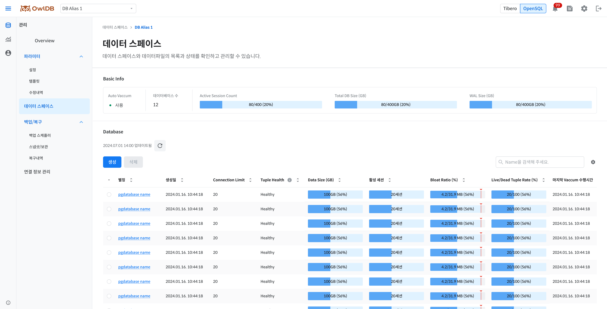

Management > Data Space Management** menu, you can query and manage databases belonging to the OpenSQL instance. From the database list, you can see each database's size, active session count, and Tuple Health status at a glance, and create or delete databases. Clicking a database alias lets you view detailed information such as Encoding, Connection Limit, and Bloat Ratio along with trend metrics.


**Note**

- OpenSQL database management is available only in Azure environments. It is not supported in AWS environments.
- If the DB engine is set to Tibero, the tablespace and data file management screen is displayed instead of this page.


<figure>

<figcaption>Figure 1. Data Space - OpenSQL</figcaption>
</figure>

## Querying the Database List

**Management > Data Space Management** When you enter the menu, the list of databases belonging to the current instance is queried. A status summary for the entire instance is displayed at the top of the page, and the detailed status of each database is shown in the central table.

### Top Summary Information

| Item | Description |
| --- | --- |
| Auto Vacuum | Whether Auto Vacuum is enabled |
| Number of Databases | Total number of databases under the instance |
| Active Session Count | Sum of active session counts across all databases (bar chart) |
| Total DB Size | Sum of the sizes of all databases |
| WAL Size | Write-Ahead Log size |

### Table Items

<table data-full-width="true"><thead><tr><th>Column</th><th>Description</th></tr></thead><tbody><tr><td>Alias</td><td><ul><li>Database name</li><li>Clicking navigates to the detailed information page</li></ul></td></tr><tr><td>Creation Date</td><td>Date and time the database was created</td></tr><tr><td>Owner</td><td>User who owns the database</td></tr><tr><td>Encoding</td><td>Character Set configured for the database</td></tr><tr><td>Connection Limit</td><td>Maximum number of concurrent connections allowed</td></tr><tr><td>Data Size</td><td>Capacity actually occupied by data (GB)</td></tr><tr><td>Active Session Count</td><td>Number of currently active sessions (bar chart)</td></tr><tr><td>Tuple Health</td><td>A status metric that combines the Dead Tuple ratio and Vacuum execution time</td></tr><tr><td>Bloat Ratio</td><td>The proportion of Dead Tuples relative to the total size (%)</td></tr><tr><td>Live/Dead Tuple Rate</td><td>Ratio of Dead Tuples to Live Tuples (%)</td></tr><tr><td>Last Vacuum Execution Time</td><td>Date and time the last Vacuum was performed</td></tr></tbody></table>

**Tuple Health** The status is determined based on the Bloat Ratio and the last Vacuum execution time.

| 3xCdwgyaRWkM | Vacuum Normal (less than 24 hours) | Vacuum Caution (24–72 hours) | Vacuum Danger (72 hours or more) |
| --- | --- | --- | --- |
| Bloat Ratio Normal (less than 20%) | Healthy | Watch | Critical |
| Bloat Ratio Caution (20–40%) | Watch | Watch | Critical |
| Bloat Ratio Danger (40% or more) | Critical | Critical | Critical |


**Note**

Tuple Health is a guide based on estimated statistics, and the actual performance impact may vary depending on traffic patterns.


You can find a specific database by entering its alias in the search box. Clicking a column header sorts in ascending/descending order, and the default sort order is ascending by alias. Clicking the 🔃 icon manually refreshes the page data.


**Note**

`postgres`, `template0`, `template1`are system default databases; they appear in the list but cannot be selected or deleted.


1. **Management > Data Space Management** Click the menu.
2. Check the status in the top summary information and the database table.
3. To find a specific database, enter its alias in the search box.

## Creating a Database

**Create** Clicking the button opens the database creation drawer on the right side of the screen. After entering the required items, **Create** Clicking the button sends the creation request and closes the drawer. Check the creation request result and completion status via the toast message displayed at the top of the screen.


**Caution**

**Cancel**Clicking this or closing the drawer resets all entered content. **Create** Changes are not saved until you click the button.


### Input Fields

<table data-full-width="true"><thead><tr><th>Field</th><th>Description</th><th>Input Rules</th></tr></thead><tbody><tr><td>Database Name *</td><td>Name of the database to create</td><td><ul><li>Only lowercase English letters (a-z), numbers (0-9), and underscores (<code>_</code>) up to 30 characters are allowed</li><li>Duplicates not allowed within the same instance</li></ul></td></tr><tr><td>Owner *</td><td>User who owns the database</td><td><code>postgres</code> (fixed value)</td></tr><tr><td>Encoding</td><td>Database Character Set</td><td>Default: <code>UTF8</code></td></tr><tr><td>Connection Limit</td><td>Maximum number of concurrent connections allowed</td><td><ul><li>Default: Unlimited</li><li>Can be entered directly when Unlimited is unchecked (integer of 0 or greater)</li></ul></td></tr></tbody></table>

*표기는 필수 입력 항목을 의미합니다.

The * mark indicates a required input field.

**Unlimited** When checked, connections are unlimited within the instance's `max_connections` range. To limit the number of connections, uncheck the checkbox and enter the desired value.

1. **Management > Data Space Management** On the page, click the **Create** button.
2. In the database creation drawer, enter the **Database Name**and the required fields.
3. **Create** Click the button.
4. Once the drawer closes, check the creation request result and completion status via the toast message.

## View Database Details

Clicking a database alias in the list navigates to that database's detail page. The page consists of three areas: basic information (Info), Database Activity, and Trend Metrics.

Clicking the 🔃 icon manually refreshes the page data. Clicking the parent menu name in the breadcrumb at the top of the page returns you to the Data Space Management list.

1. **Management > Data Space Management** In the database list on the page, click the **alias**of the database you want to view.
2. Check the status and current state in the basic information, Database Activity, and Trend Metrics areas.

### Displayed Fields

**Basic Information (Info)**

| Field | Description |
| --- | --- |
| Creation Date | Date and time the database was created |
| Tuple Health | Status indicator based on the Dead Tuple ratio and Vacuum execution time (Healthy / Watch / Critical) |
| Last Vacuum Execution Time | Date and time the last Vacuum was executed |
| Owner | User who owns the database |
| Encoding | Character Set configured for the database |
| Connection Limit | Maximum number of concurrent connections allowed |

**Database Activity**

<table data-full-width="true"><thead><tr><th>Field</th><th>Description</th></tr></thead><tbody><tr><td>DB Size</td><td>Capacity actually occupied by data (GB)</td></tr><tr><td>Active Session Count</td><td><ul><li>Number of currently active sessions (line chart)</li><li>Individual session lines displayed per node in an HA configuration</li></ul></td></tr></tbody></table>

**Trend Metrics**

| Item | Description |
| --- | --- |
| Bloat Ratio (%) | Ratio of Dead Tuples relative to the total size |
| Live Tuple Count (CNT) | Number of Live Tuples in the database |
| Dead Tuple Count (CNT) | Number of Dead Tuples in the database |
| Live/Dead Tuple Rate (%) | Ratio of Dead Tuples relative to Live Tuples |

## Deleting a Database

A database can be deleted from two locations: the list page and the details page. When you click the delete button, a confirmation modal appears, and the deletion proceeds after final confirmation in the modal.


**Caution**

Deletion operations cannot be undone. All data and objects contained in the database are permanently deleted, and connected applications may experience immediate failures.


1. **Management > Data Space Management** On the page, navigate to the database you want to delete. **[List Page]** Select the database to delete using the radio button. **[Details Page]** Of the database to delete, **alias**Click to move to the details page.
2. **Delete** Click the button.
3. In the delete confirmation modal, verify the deletion target and scope of impact.
4. **Delete** Click the button.
5. Verify the deletion result through the toast message.
