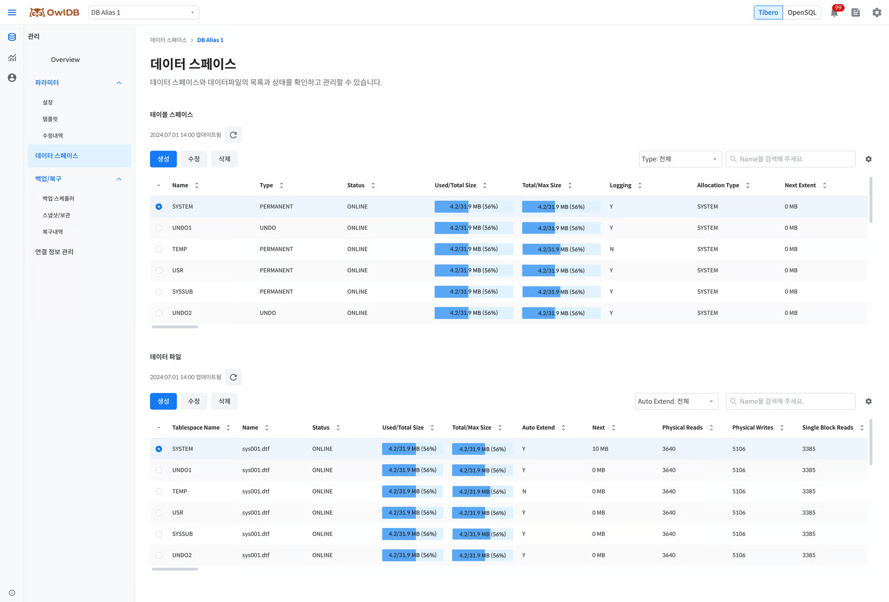

Queries, creates, modifies, and deletes the storage space (tablespaces and data files) of databases operating in OwlDB. A single tablespace can contain multiple data files.


**Note**

- Tablespaces can only be queried, modified, or deleted when the database status is `Running`.
- When the DB engine is set to OpenSQL, the database management screen is displayed instead of this page.


<figure>

<figcaption>Figure 1. Data Space - Tibero</figcaption>
</figure>

# Query Tablespace

1. **OwlDB Console Screen > Management > Tablespace** Navigate to the menu.
2. **DB Alias** Click the dropdown button to select the database whose tablespaces you want to query.
3. Queries the tablespace list. You can filter the list by type. You can search directly by name.

<table data-full-width="true"><thead><tr><th>Item</th><th>Description</th></tr></thead><tbody><tr><td>Name</td><td>Tablespace name</td></tr><tr><td>Type</td><td>Tablespace type<ul><li><strong>Permanent</strong>: Stores permanent data; generally the most commonly used type</li><li><strong>Temporary</strong>: Stores temporary data; data is deleted when the session ends or the operation completes</li><li><strong>Undo</strong>: Stores modified data</li></ul></td></tr><tr><td>Status</td><td>Tablespace status<ul><li><strong>ONLINE</strong>: A state in which it is properly connected to the database and available for use</li><li><strong>OFFLINE</strong>: A state in which it is disconnected from the database (objects stored in the tablespace cannot be accessed)</li></ul></td></tr><tr><td>Used/Total Size</td><td><ul><li><strong>Used Size</strong>: The total space in use by the data files belonging to that tablespace</li><li><strong>Total Size</strong>: The total space allocated to the data files belonging to that tablespace</li></ul></td></tr><tr><td>Total/Max Size</td><td><ul><li><strong>Total Size</strong>: The total space allocated to the data files belonging to that tablespace</li><li><strong>Max Size</strong>: The total maximum space that can be allocated to the data files belonging to that tablespace</li></ul></td></tr><tr><td>Logging</td><td>Whether logging is enabled</td></tr><tr><td>Allocation Type</td><td>Extent allocation method<ul><li><strong>SYSTEM</strong>: A method that dynamically allocates extent sizes according to system requirements</li><li><strong>UNIFORM</strong>: A method that stores objects using extents of the same size</li></ul></td></tr><tr><td>Next Extent</td><td>Next allocation extent size</td></tr></tbody></table>

---

# Create Tablespace

1. **OwlDB Console Screen > Management > Tablespace** Navigate to the menu.
2. **DB Alias** Click the dropdown button to select the database in which you want to create a tablespace.
3. **Create** Click the button.


**Note**

Based on a data block size of 8KB, even if UNIFORM SIZE is set smaller than 128KB, it is set to 128KB, the minimum extent size.


---

# Modify Tablespace

1. **OwlDB Console Screen > Management > Tablespace** Navigate to the menu.
2. **DB Alias** Click the dropdown button to select the database whose tablespace you want to modify.
3. **Modify** Click the button.

---

# Delete Tablespace

1. **OwlDB Console Screen > Management > Tablespace** Navigate to the menu.
2. **DB Alias** Click the dropdown button to select the database whose tablespace you want to delete.
3. **Delete** Click the button.

---

# Query Data File

1. '[Query Tablespace](#테이블스페이스-조회)' to select the database whose data files you want to query.
2. **Tablespace** Click the radio button to select the tablespace whose data files you want to view.
3. Views the list of data files. You can filter the list by whether auto-extend is enabled. You can search directly by data file name.

<table data-full-width="true"><thead><tr><th>Item</th><th>Description</th></tr></thead><tbody><tr><td>Tablespace Name</td><td>Tablespace name</td></tr><tr><td>Name</td><td>Data file name</td></tr><tr><td>Online Status</td><td>Data file status<ul><li><strong>SYSOFF</strong>: System offline file</li><li><strong>SYSTEM</strong>: System online file</li><li><strong>OFFLINE</strong>: Offline status</li><li><strong>ONLINE</strong>: Online status</li><li><strong>RECOVER</strong>: A state requiring recovery</li><li><strong>AVAILABLE</strong>: Available status</li></ul></td></tr><tr><td>Used/Total Size</td><td><ul><li><strong>Used Size</strong>: The amount of space currently in use by the data file</li><li><strong>Total Size</strong>: The amount of space allocated to the data file</li></ul></td></tr><tr><td>Total/Max Size</td><td><ul><li><strong>Total Size</strong>: The amount of space allocated to the data file</li><li><strong>Max Size</strong>: The maximum amount of space that can be allocated to the data file</li></ul></td></tr><tr><td>Auto Extend</td><td>Whether auto-extend is enabled</td></tr><tr><td>Next</td><td>Next extension size</td></tr><tr><td>Physical Reads</td><td>Number of physical reads</td></tr><tr><td>Physical Writes</td><td>Number of physical writes</td></tr><tr><td>Single Block Reads</td><td>Number of single block reads</td></tr></tbody></table>

---

# Creating a data file

1. '[Viewing Data Files](#데이터-파일-조회)' to select the tablespace in which to create the data file.
2. **Create** Click the button.

---

# Modifying a data file

1. '[Viewing Data Files](#데이터-파일-조회)' to select the tablespace in which to modify the data file.
2. **Modify** Click the button.

---

# Deleting a data file

1. '[Viewing Data Files](#데이터-파일-조회)' to select the tablespace from which to delete the data file.
2. **Delete** Click the button.
