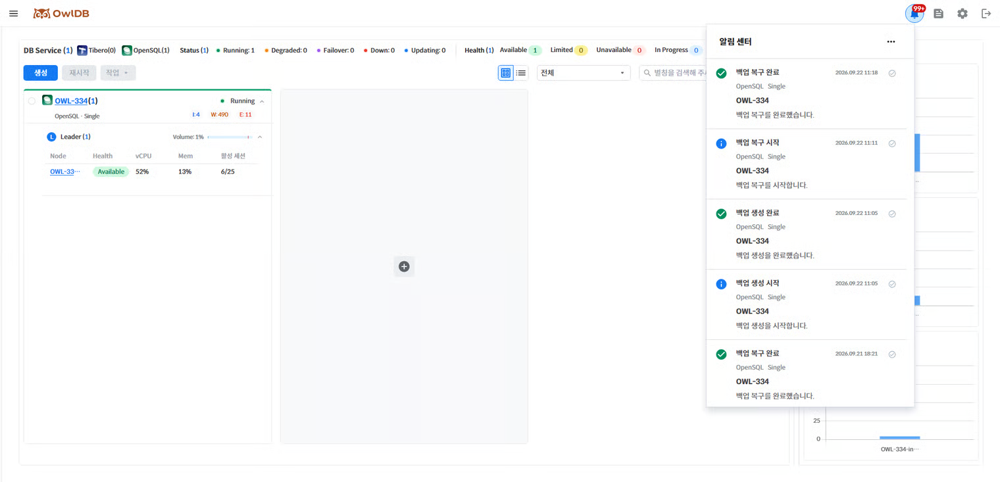

OwlDB provides notifications for various events that occur while using it. Notifications can be viewed by clicking the 🔔 icon in the upper-right corner of the console screen.

<figure>

<figcaption>Figure 1. Notifications</figcaption>
</figure>

- Click the ✔ icon on the right side of a message to change its read status.
- Messages marked as read are automatically deleted after 30 days.
- Upper-right corner **Meatball menu** icon > **Mark all as read**Clicking this marks all messages as read.
