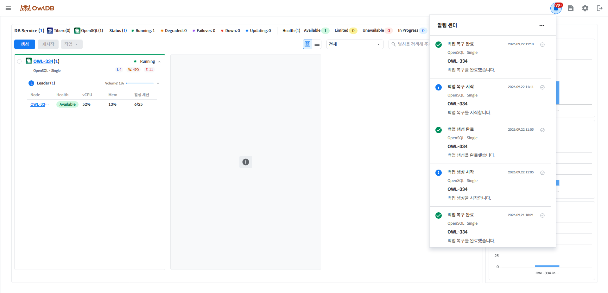

# Notifications

OwlDB provides notifications for various events that occur while using OwlDB. To view notifications, click the 🔔 icon in the upper-right corner of the console screen.

<figure><figcaption>
Figure 1. Notifications
</figcaption></figure>

* Click the ✔ icon on the right of a message to change its read status.
* Messages marked as read are automatically deleted after 30 days.
* Click **Mark all as read** in the upper-right **Meatball menu** to mark all messages as read.
